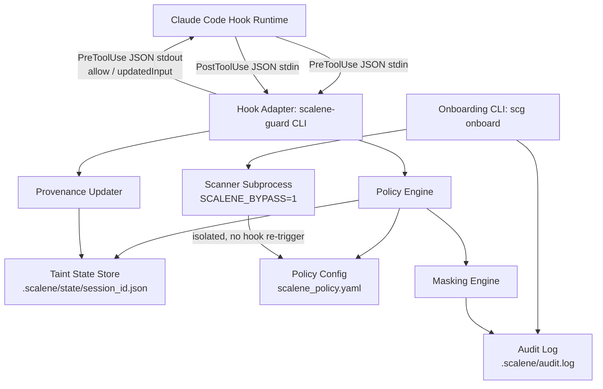
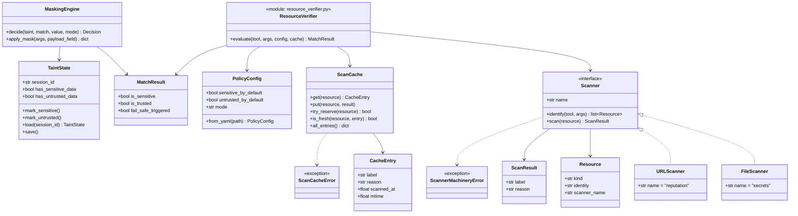
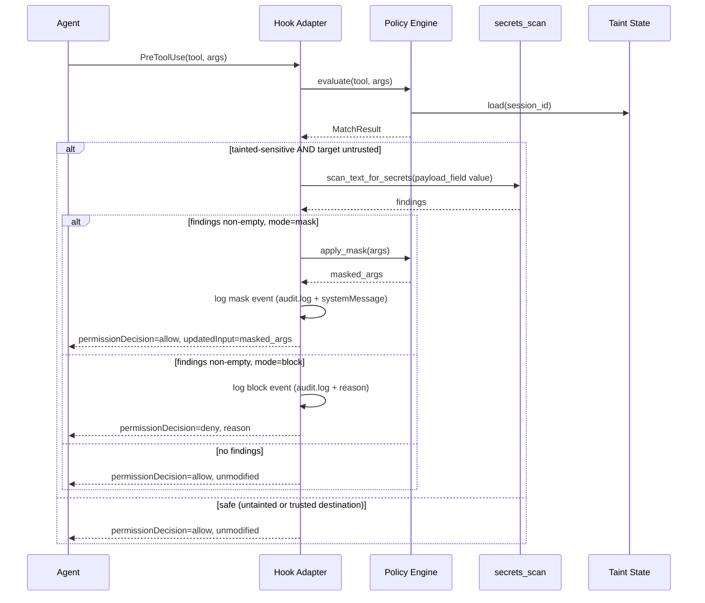
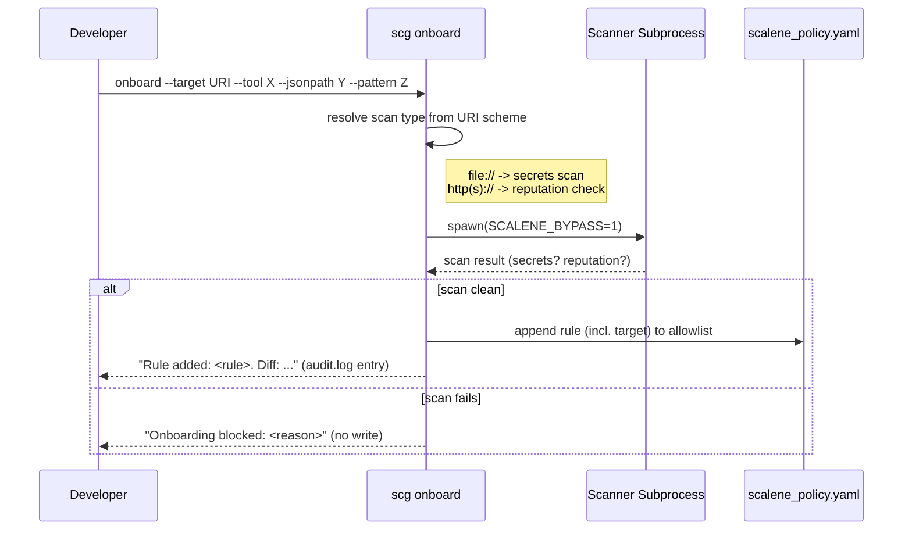

# Project Architecture (ARCH.md) — Project Scalene

Maintained by **Morpheus**. Status: Sprint 1 (§1-10) shipped 2026-07-09. Sprint 2 (§11) shipped 2026-07-10. Sprint 3 (§12) implemented 2026-07-14 (retro/launch pending). Sprint 4 (§13) — Draft v1, pending Smith Gate 2. **§4's class diagram predates §13 and will be revised during Sprint 4 implementation** (`PolicyRule`/`PolicyConfig.allowlist` are replaced per §13.1 — not reflected below yet, Neo to update alongside the code change).

## 1. System Overview

Scalene is a provenance-based DLP layer for AI coding agents. It sits between the agent harness (Claude Code, initially) and its tools, tracking where data came from and blind-masking payloads when tainted-sensitive data would flow to an untrusted destination. It has two layers:

- **Hook Adapter** — thin, harness-specific integration (v1: Claude Code `PreToolUse`/`PostToolUse` hooks).
- **Policy Engine** — harness-agnostic core: taint state machine, JSONPath rule matching, masking decision, onboarding.

Splitting these means porting to a second harness (Cursor, etc.) later is an adapter, not a rewrite.

## 2. Architectural Principles

- **Deterministic over probabilistic**: rule matching (JSONPath), not content/NLP inspection — keeps latency and behavior predictable (NFR: <15ms).
- **Fail-safe by default**: any ambiguity resolves to `sensitive=true, trusted=false` (BRD 2.4).
- **No daemon required**: stateless-process-per-hook-call model, state externalized to disk. Simpler to reason about, trivially portable across local/Docker/cloud (NFR-Portability) — no background service to manage or crash-recover.
- **Adapter isolation**: nothing in the policy engine imports or knows about Claude Code's hook JSON schema. The adapter translates in both directions.

## 3. Component Diagram



## 4. Class & Data Structures



**Full replacement, not incremental simplification (2026-07-15, Sprint 4 / E10, §13.1):** `PolicyConfig.allowlist`/`PolicyRule` (the "one unified allowlist keyed by target scheme" model, itself only one commit old) is removed entirely — the defect this epic exists to fix (a rule's one-time scan vouching for an unbounded future pattern match) is structural to pattern-matching itself, not something an incremental schema tweak could fix. `PolicyConfig` now only carries the sensitivity/trust defaults and `mode`; resource identification (`Scanner`/`FileScanner`/`URLScanner`) and verification (`ScanCache`, `ResourceVerifier.evaluate()`) replace rule-matching entirely, per §13. `docs/BRD.md` is left as the original historical requirements doc, not updated to match — same treatment as `task.md`/`USER_STORIES.md`.

## 5. Sequence & Interaction Flows

### Pre-tool-call (masking/blocking path)

Response shape uses Claude Code's real `PreToolUse` hook contract
(`hookSpecificOutput.permissionDecision`/`updatedInput`/`permissionDecisionReason`)
— corrected 2026-07-14; a prior flat `{"allow": ..., "updatedInput": ...}`
shape was never part of that contract and was silently ignored by the real
harness. Masking/blocking is also content-gated (2026-07-14): provenance
(taint + untrusted destination) only decides whether to scan at all —
`secrets_scan.py` must actually find something before any action is taken.



### Onboarding



## 6. Technical Stack

- **Language**: Python 3.11+. Rationale: matches the surrounding tool ecosystem (`via` is pip-installed per this repo's own tooling), fast to iterate, `jsonpath-ng` and `pyyaml` cover the config/matching needs without custom parsing.
- **Distribution**: pip-installable CLI (`scalene-guard`), invoked as the hook `command` in `.claude/settings.json` (`hooks.PreToolUse[].hooks[].command`, `hooks.PostToolUse[].hooks[].command`).
- **State store**: flat JSON files under `.scalene/state/<session_id>.json`, file-locked (`filelock`) for the rare concurrent-call case. No database, no daemon.
- **Config**: `scalene_policy.yaml` at project root, loaded fresh per hook invocation (no caching across process boundaries — config is small, load cost is negligible against the 15ms budget).
- **Scanner isolation**: `subprocess.run` with `env={"SCALENE_BYPASS": "1", ...}`, not a container — keeps it portable to environments without container runtime access, while still preventing the scanner's own tool calls (if any) from re-entering the hook loop.

## 7. Resolved Open Questions (from Cypher's `docs/USER_STORIES.md`)

1. **Runtime/hook API target** → Claude Code's native `PreToolUse`/`PostToolUse` hook system for v1 (this is the same hook mechanism this very repo's session is running under). Policy engine kept adapter-isolated so Cursor/others can be added later without a rewrite.
2. **Taint state persistence** → Per-session JSON file keyed by Claude Code's `session_id` (present in every hook JSON payload), not in-memory/daemon. Survives individual hook subprocess exits; cleared on explicit reset or session end.
3. **Hook registration mechanism** → Standard Claude Code `settings.json` hook config (matcher + command), documented in project setup instructions (Neo to write during implementation).
4. **Threat-intel service for trust-list onboarding (STORY-501)** → **Decision: no paid external API in v1.** Ships with `LocalHeuristicChecker` (new/suspicious domain patterns, IP-literal targets, punycode homograph detection) behind a `ReputationChecker` interface. Removes the external-dependency/env-var concern Cypher flagged for Tank — reassess with Tank only if/when a real threat-intel API is added post-v1.

## 8. Response to Smith's Gate 1 Notes

- **STORY-401 masking visibility**: Adapter writes every mask event to `.scalene/audit.log` AND returns a Claude Code `systemMessage` in the PreToolUse hook response, so the event surfaces directly in the transcript the developer is watching — not just a silently swapped string. Cypher: please add this as explicit AC on STORY-401.
- **STORY-501 onboarding confirmation**: `scg onboard` prints the rule added plus a YAML diff on success, and writes the same to `audit.log`. Cypher: please add as explicit AC on STORY-501.

## 9. Devops/Infra Impact (for Tank)

- STORY-601 (`SCALENE_BYPASS` env var) — confirmed as a subprocess env var, not a system-wide/CI env var. No CI pipeline changes needed for v1.
- STORY-501's original Tank flag (external threat-intel API) is **resolved** by decision #4 above — no external network egress in v1. Tank review still useful for confirming `.scalene/` directory placement doesn't collide with `.gitignore`/CI artifact rules, but is no longer a hard gate.

## 10. Refactoring Status & Technical Debt

None yet — greenfield. First implementation phase should establish the `PolicyEngine`/`Adapter` boundary early since it's the seam most likely to be tested by a second-harness port later.

---

## 11. Sprint 2 Architecture — Live Console (E7) & Secrets Scan Upgrade (E8)

### 11.1 Decision: TUI, not a web frontend

Cypher's stories left TUI-vs-web-frontend open. **Decision: TUI, built on `textual`.**

Reasons:
- A web frontend needs a bound localhost port and (likely) a small web-server dependency (Flask/FastAPI) — this project currently has zero web-server dependencies, and binding a port is exactly the kind of thing that would trigger a Tank infra review. A TUI reads local files directly and needs neither.
- The user's own framing was "a TUI or web frontend the user runs alongside their Claude session" — a terminal-native tool sits in the same terminal workflow a developer already has open; no browser tab, no localhost URL to remember (Nielsen #7, fewer things for the user to juggle).
- Matches the existing distribution model exactly: another `scg` console-script subcommand (`scg monitor`), same pip package, no new deployment surface.
- **Consequence: no Tank gate needed for Sprint 2** — no new port, service, env var, or CI/deploy impact. Same precedent as Sprint 1 (no Tank phase; reassess if this ever grows into a hosted/team-shared dashboard instead of a local single-developer tool).

**Packaging note:** `textual` is added as an optional extra (`pip install scalene-guard[monitor]`), not a hard dependency of the base package — the hot-path hook adapter (`scalene-guard`, <15ms NFR) must never import a TUI framework it doesn't use.

### 11.2 Data access: poll, don't watch

`.scalene/audit.log` and `.scalene/state/*.json` are read via simple polling (fixed interval, e.g. every 500ms — Neo to tune during implementation) rather than an inotify-style filesystem watcher. Reason: consistent with NFR-Portability (inotify-based watching is flaky on some Docker bind-mounts and network filesystems); the files are small, so poll cost is negligible; avoids a new dependency (`watchdog`) for a dev-only convenience tool.

### 11.3 Session scope (resolves Smith's Gate 1 note)

Every audit entry and state file already carries `session_id` (`hook_adapter.py:105`, `taint_state.py`). Decision: the console's default view lists all sessions with a discoverable state file (recent-first), each showing its own taint flags; selecting one filters the mask-event feed to that session. An aggregate "all sessions" feed is also available as a toggle — real developers commonly run more than one agent session at once, and neither "always merge" nor "always force a single-session pick" serves that alone.

**Cypher: please add this as explicit AC on STORY-701** (mirrors how Sprint 1's §8 response fed back into story AC).

### 11.4 Onboarding action (STORY-702)

The console's "apply" action is a **subprocess call to the existing `scg onboard` CLI** using the exact `suggested_onboard_command` string already generated by `hook_adapter.py`, with the placeholder target substituted by the user's inline edit. This is a UI shell, not a reimplementation — it goes through the same secrets-scan/reputation-check gates as running the command by hand. No new code path in `onboard.py` itself.

### 11.5 Secrets scan upgrade (E8) — error message translation layer (resolves Smith's Gate 1 note)

`secrets_scan.py` already produces its own plain-language scan-result messages rather than surfacing regex internals. The `detect-secrets` integration must preserve that: detect-secrets' plugin/detector output is translated into the existing result format inside `secrets_scan.py`, never surfaced as raw library exception text to the onboarding CLI's user-facing output.

**Cypher: please add this as explicit AC on STORY-801.**

## 12. Sprint 3 Architecture — Documentation & Onboarding (E9)

STORY-901/902 are pure documentation — no new architecture decisions, just placement:

- `docs/GETTING_STARTED.md` and `docs/USER_GUIDE.md` are new top-level docs under `docs/`, added to `README.md`'s documentation table (per Smith Gate 1). `README.md`'s existing "Getting started" section is trimmed to a link, not a duplicate.
- STORY-902's CLI reference must be generated/verified against real `--help` output (`scg --help`, `scg onboard --help`, `scg monitor --help`, `scg install-hooks --help`, `scalene-guard --help`) at write time — Neo checks this by actually running each command, not transcribing from memory of the source.
- Per Smith's Gate 1 note: the onboard-suggestion workflow (`_suggest_onboard_command()`, §4/§11.4) must be the guide's primary onboarding path, with the raw manual-flag `scg onboard` invocation presented as the fallback for cases with no prior blocked call to suggest from.

### 12.1 Decision: demo is a real `scalene-guard` subprocess run, not a mocked walkthrough

STORY-903 requires the demo show a *real* masked call, offline, and be checked by a test so it can't rot silently. Decision: a small script (`demo/run_demo.py`) that:

1. Builds a temp project dir with a minimal `scalene_policy.yaml` (no sensitive allowlist, no trusted sources — matches the fail-safe defaults new users actually hit first).
2. Invokes the real `scalene-guard` CLI as a subprocess, feeding it real `PreToolUse`/`PostToolUse` JSON payloads on stdin exactly as Claude Code would (same entry point as production, per §1's adapter-isolation principle — this is not a call to internal functions that could drift from the real CLI contract).
3. Scenario matches the BRD's Triangle-of-Doom case directly: a `Read` of a fake "sensitive" file (sets `has_sensitive_data`), followed by a `WebFetch` to a domain that is not on the trust list (untrusted destination) — the second call's response shows the payload masked.
4. Prints each step with plain-language narration (what happened and why) so it reads as a demo, not raw JSON — but the underlying JSON is real `scalene-guard` output, not fabricated for display.

**Why this stays offline (STORY-903 AC):** `scalene-guard` never performs the tool call itself — it only returns an allow/mask decision (§1, hook adapter is decision-only). The demo never actually issues the `WebFetch` HTTP request; showing the masked `tool_input`/response *is* the entire demonstration. No mocking is needed to keep this offline — it's a structural property of the architecture, not a demo-specific shortcut.

### 12.2 Decision: demo is tested, not just runnable

`tests/test_demo.py` invokes `demo/run_demo.py` as a subprocess (same as a user would) and asserts the final output contains the expected masking marker and does not contain the fake secret in unmasked form. This runs under ordinary `pytest`/`make test` collection — no separate CI wiring needed. `make demo` (new Makefile target) runs the same script directly for a human to watch, narration included.

**No Tank gate needed:** no new service, port, env var, or deploy/CI impact — `demo/run_demo.py` is a local dev-only script in the same vein as Sprint 1/2's no-Tank precedent.

## 13. Sprint 4 Architecture — Extensible Scanner Registry & Resource Verification (E10)

### 13.1 Decision: replace the allowlist/PolicyRule matching model, don't bolt scanning on top of it

Cypher's epic left this as an explicit open question. **Decision: full replacement**, not coexistence. `PolicyConfig.allowlist`/`PolicyRule` (tool/jsonpath/pattern/target, shipped one commit before this epic) is removed entirely, not deprecated alongside a new system.

Reasoning: the defect this epic exists to fix — a rule's `pattern` can match an unbounded future set while its `target` was only ever scanned once — is structural to the pattern-matching model itself, not a bug in one implementation of it. Any coexistence would keep the hole open for whichever rules stay on the old path. The new model's resource-identity granularity (a URL scanner's resource is a *host*, not a full URL) already gives broad, reusable coverage — "trust `internal.example.com`" naturally covers every path under it — without needing a hand-written regex to express "broad." The old model's flexibility isn't lost, it's absorbed into resource-identity choice.

`scg onboard` is **not removed** — it's re-scoped from "write a policy rule" to "pre-seed the resource cache" (§13.4): given a target, run the matching scanner against it right now and write the result into the same cache the live hook consults, so a developer can front-load the first-sighting cost for a resource they already know is fine, instead of eating it the first time an agent hits it live.

### 13.1.1 How this fits into the existing `pre_tool_use`/`post_tool_use`/`MaskingEngine` flow

Two *different* checks exist today and stay separate — this epic replaces one of them, not both:

1. **Content-gating (shipped, unrelated to this epic):** `MaskingEngine.decide()` scans the *specific payload value being sent* (e.g. an outbound `prompt`) for embedded secrets via `scan_text_for_secrets()`, gated behind provenance risk. This governs *whether to mask/block this specific call*. **Unchanged by E10.**
2. **Resource verification (this epic, replaces `PolicyConfig.evaluate()`):** governs the *provenance signals themselves* — `is_sensitive` (does a `Read`'s target count as sensitive) and `is_trusted` (does a call's destination count as trusted). Previously computed by matching `PolicyRule`s; now computed by asking the scanner registry to identify resources in the call's args and checking the resource cache.

Concretely, `hook_adapter.py` changes from `match = config.evaluate(tool, args)` to something like `match = resource_verifier.evaluate(tool, args)`, returning the same `MatchResult(is_sensitive, is_trusted, fail_safe_triggered)` shape both `pre_tool_use` and `post_tool_use` already consume — `MaskingEngine.decide()`'s signature and content-gating logic don't change at all. `fail_safe_triggered` now means "at least one identified resource had no cache entry and fell back to defaults," replacing its old meaning ("a rule's JSONPath failed to evaluate") — same field, same downstream handling (existing tests/log messages), new trigger condition.

### 13.2 Component: Scanner protocol + registry

```python
class Scanner(Protocol):
    name: str  # "secrets", "reputation", ... — the label namespace this scanner owns

    def identify(self, tool_name: str, args: dict) -> list[Resource]:
        """Find candidate resources this scanner cares about within a call's
        args. No jsonpath/pattern from user config — each scanner owns its
        own detection logic (STORY-1002)."""

    def scan(self, resource: Resource) -> ScanResult:
        """Verify one resource. Runs in an isolated subprocess (SCALENE_BYPASS=1,
        unchanged from today's subprocess_isolation.py) — never raises to the
        caller; a scanner-internal exception is what makes STORY-1004's fatal
        path fire, not what gets returned as a ScanResult."""

@dataclass(frozen=True)
class Resource:
    kind: str          # "file" | "url" — extensible, not a closed enum
    identity: str       # cache key material: absolute path, or host
    scanner_name: str

@dataclass(frozen=True)
class ScanResult:
    label: str          # "public" | "sensitive" | "trusted" | "untrusted"
    reason: str = ""
```

Registry is a plain `dict[str, Scanner]` populated at import time (`SCANNERS = {"secrets": FileScanner(), "reputation": URLScanner()}`) — adding a scanner is adding an entry, no dispatch code changes (STORY-1002 AC).

**Built-in scanners (STORY-1002):**
- `FileScanner` — `identify()` checks known per-tool fields first (`Read`/`Write`/`Edit`'s `file_path`/`new_string`/`content`-adjacent path arguments, reusing today's `DEFAULT_PAYLOAD_FIELDS`-style knowledge internally, not exposed to config) plus a generic "does this string look like an absolute/relative path" regex fallback for anything else. `scan()` is today's `secrets_scan.py` unchanged, run against the file's content.
- `URLScanner` — `identify()` checks known fields (`WebFetch`'s `url`) plus a generic `https?://` regex fallback. Resource identity is the **host**, not the full URL (§13.1). `scan()` is today's `LocalHeuristicChecker` unchanged.
- **Bash command scanner: not a third scanner type.** Decision: `Bash`'s `command` string is handed to *both* `FileScanner.identify()` and `URLScanner.identify()`'s generic fallback regexes as an additional input source, since a shell command is just a string that may embed either shape. A dedicated `BashScanner` would only duplicate the same shape-detection regexes FileScanner/URLScanner already need for their generic fallback — no new scanner type needed, just wiring `Bash` into both existing scanners' `identify()`.
- Named regex captures (STORY-1001) are an internal detail of each scanner's own detection regex (e.g. `URLScanner`'s fallback pattern has a `(?P<host>...)` group it extracts and discards the rest of) — not a user-facing config concept. There is no more user-authored `jsonpath`/`pattern` for this purpose at all (§13.1).

### 13.3 Component: Scan cache

`.scalene/scan_cache.json`, project-wide (not per-session — a file's or host's verification status isn't session-scoped), file-locked like `taint_state.py`'s per-session files (`filelock`, same pattern, not a new dependency):

```json
{
  "file:///abs/path/to/file.md": {"mtime": 1720000000.0, "label": "public", "reason": "", "scanned_at": 1720000000.0},
  "reputation:internal.example.com": {"label": "trusted", "reason": "", "scanned_at": 1720000000.0}
}
```

Key is `f"{scanner_name}:{resource.identity}"` (file resources additionally carry `mtime` inside the value, not the key, since re-verifying a changed file should overwrite its entry rather than accumulate stale ones per-mtime).

**Lookup/refresh logic (STORY-1003), run for every identified resource on every call:**

| Cache state | Label used for *this* call | Rescan? |
|---|---|---|
| No entry | Existing fail-safe default (`sensitive_by_default`/`untrusted_by_default`) — **identical to today's behavior for an unconfigured resource, no new latency** | Fire-and-forget background scan, seeds cache for next time |
| Fresh (<24h, and for files: `mtime` unchanged) | Cached label, direct | None |
| Expired (>24h, or file `mtime` changed) | Last-known cached label, immediate, no blocking | Fire-and-forget background scan, refreshes cache |

This is why the "new resource" path is *not* a regression risk for the **decision** it produces: it applies exactly the same fail-safe default today's code does, so the label a caller acts on never changes. Only the *previously-scanned* paths get faster than fail-safe defaults, and only once something has actually been verified.

**NFR revision, 2026-07-14 (Morpheus's Phase 2 review, informed by real measurement, not assumption):** the "zero added latency" framing above was wrong about *wall-clock cost*, only right about *decision behavior*. `refresh_if_needed()`'s fire-and-forget `subprocess.Popen` spawn (the "merely adds a side-effect" step) is not free — measured at ~6.6ms avg / ~16ms max per newly-identified resource in this environment, isolated to the spawn syscall itself (reproduced identically with a trivial no-op command, ruling out worker-script complexity as the cause).

Splitting the NFR to be honest about this rather than letting Phase 3's perf test discover it as a surprise:
- **`NFR-Perf-Steady-State`** (unchanged, <15ms): applies whenever every identified resource in a call has a fresh cache entry — pure JSON-cache reads under a `FileLock`, no subprocess spawn, genuinely the same cost as today's pre-Sprint-4 code.
- **`NFR-Perf-FirstSighting`** (new, provisional): a call that identifies N never-before-seen (or expired) resources pays roughly N × spawn-cost in *added* latency on top of the steady-state cost, since each triggers its own dedup-checked `Popen` spawn. Provisional budget: **<25ms added latency per newly-identified resource** (headroom over the measured ~16ms worst case). This is a one-time cost per resource — paid once, then the resource is cache-fresh for 24h and falls back under `NFR-Perf-Steady-State` for every subsequent call. Phase 3 task 3.4 must verify this NFR with a real test (analogous to `tests/test_performance.py`'s existing steady-state test), not assume the provisional number holds — same "verify, don't assume" standard as the hook-contract exit-code work.
- Accepted deliberately over redesigning the spawn mechanism (e.g., batching multiple resources into one spawn, or decoupling from the synchronous `pre_tool_use` path) — the added cost is one-time-per-resource and self-amortizing (every subsequent call on that resource is free), judged not worth the added design complexity for a per-resource cost this bounded.

**"Background" mechanism:** `subprocess.Popen` (not `subprocess.run`) with no `.wait()` — the child scanning process (running with `SCALENE_BYPASS=1`, same isolation as today) writes its result into the cache file (via the same `FileLock`) whenever it finishes, independent of the parent `scalene-guard` process having already exited and returned its response. No daemon, no persistent process — consistent with §2's "no daemon required" principle; each background scan is a one-shot detached subprocess, same lifecycle model as everything else in this codebase.

**File staleness uses `mtime`, not a content hash** (Smith/user direction) — `os.stat().st_mtime` is effectively free; hashing file content on every call would reintroduce the exact performance problem this cache exists to solve.

### 13.4 `scg onboard` re-scoped: pre-seed the cache

```
scg onboard --target file:///path/to/file.md
scg onboard --target https://internal.example.com
```

Drops `--tool`/`--jsonpath`/`--pattern`/`--description` entirely (§13.1 — there's no rule to author anymore, just a resource to check now instead of later). Resolves the scanner from the URI scheme exactly as today (`file://` → `FileScanner`, `http(s)://` → `URLScanner`), runs `scan()` synchronously (this is the one deliberately-blocking scan path left in the system, and it's fine — it's a one-off CLI invocation, not the hot hook path), and writes the result into `.scalene/scan_cache.json` directly. No more separate `scalene_policy.yaml` `allowlist` writes, no diff-printing (there's no YAML edit to diff) — prints the resolved label instead.

### 13.5 STORY-1004: fatal exit — exact boundary and mechanism

**Fail-safe-exit-0 (unchanged from today):** malformed hook JSON, unrecognized hook event, a scanner's `identify()`/`scan()` returning an ordinary bad result (secret found, bad reputation) — all ordinary decisions, `scalene-guard` exits 0 exactly as it does today.

**Fatal-exit-nonzero (new, narrow):** the scan **cache store itself** is unreadable/corrupted/unwritable, or a registered scanner's `scan()`/`identify()` raises an unhandled exception (a bug in scanner code, not a scan finding). This is a "the safety mechanism can't do its job" condition, categorically different from "the safety mechanism did its job and found something."

**Exit code: verified as 2** (2026-07-15, Neo — not assumed, not left provisional). Checked two ways: (1) fetched Claude Code's real hook docs, which are explicit — "Claude Code treats exit code 1 as a non-blocking error and proceeds with the action, even though 1 is the conventional Unix failure code... only exit code 2 blocks [PreToolUse]"; (2) live-verified against this very repo's own dogfooded `scalene-guard` installation (`.claude/settings.json` wires the real, editable-installed binary as this session's actual hook) — corrupted the real `.scalene/scan_cache.json`, confirmed a real tool call passed through completely unaffected while the fatal path returned exit 1, then confirmed exit 2 is what's actually required to block a `PreToolUse` call. The architecture's original caution above (don't assume exit 2's semantics carry over from the earlier hook-contract research) was a reasonable question to raise, but the real contract doesn't distinguish "deliberate policy block" from "machinery failure" by cause — it only cares about the exit code value. Exit 2 is used uniformly for both `PreToolUse` (where it correctly blocks — the fail-closed behavior this story wants: if the scanning machinery can't be trusted, stop the call rather than let it through unchecked) and `PostToolUse` (where exit 2 is explicitly non-blocking too, same as any other non-zero code, which is correct since the tool has already run by then).

**Message:** same plain-language standard as `secrets_scan.py`/`onboard.py` — a fatal exit still writes a real reason to stderr, never a raw traceback (Smith Gate 1 note).

**Labels always surfaced regardless of fatal/non-fatal:** whatever labels *did* resolve for other resources in the same call (e.g. one resource's scanner is fine, another's cache store lookup is what failed) are still included in the response — a fatal condition on one resource doesn't blank out information that was actually available.

### 13.6 STORY-1005: recent scans surfaced in `scg monitor`

New panel alongside the existing Sessions/Mask-events tables (`monitor_app.py`), reading `.scalene/scan_cache.json` directly (poll-based, same §11.2 precedent — no filesystem-watch dependency). Columns: resource identity, label, last-scanned time. This is a read of the real cache store, not a parallel summary that could drift from it (STORY-1005 AC).

### 13.7 Devops/Infra impact

No Tank gate: still no daemon, no new port/service/env var. The one new behavior worth Tank's awareness (not a gate) is background subprocess spawning via `Popen` without `wait()` — confirm this doesn't leave zombie/orphaned processes in constrained container environments; Neo to verify during implementation with a real, repeated-invocation test, not just a single-call check.
