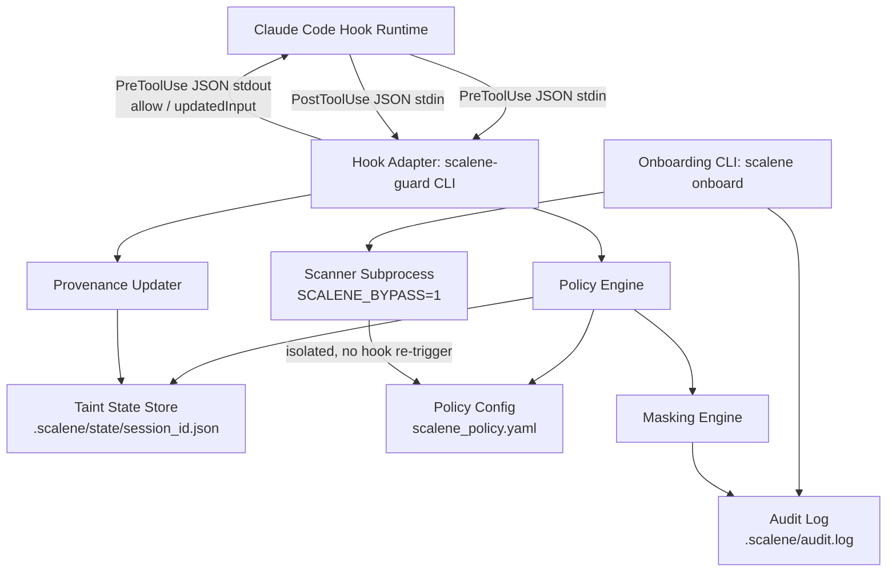
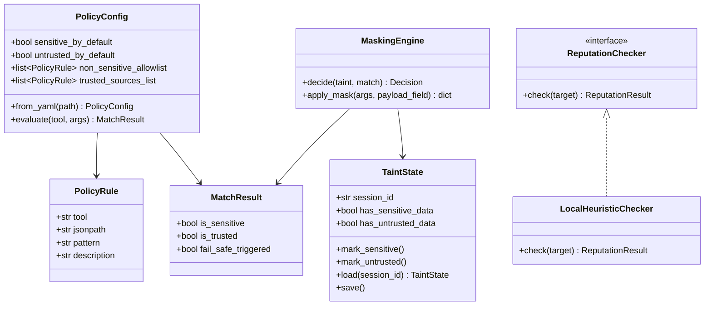
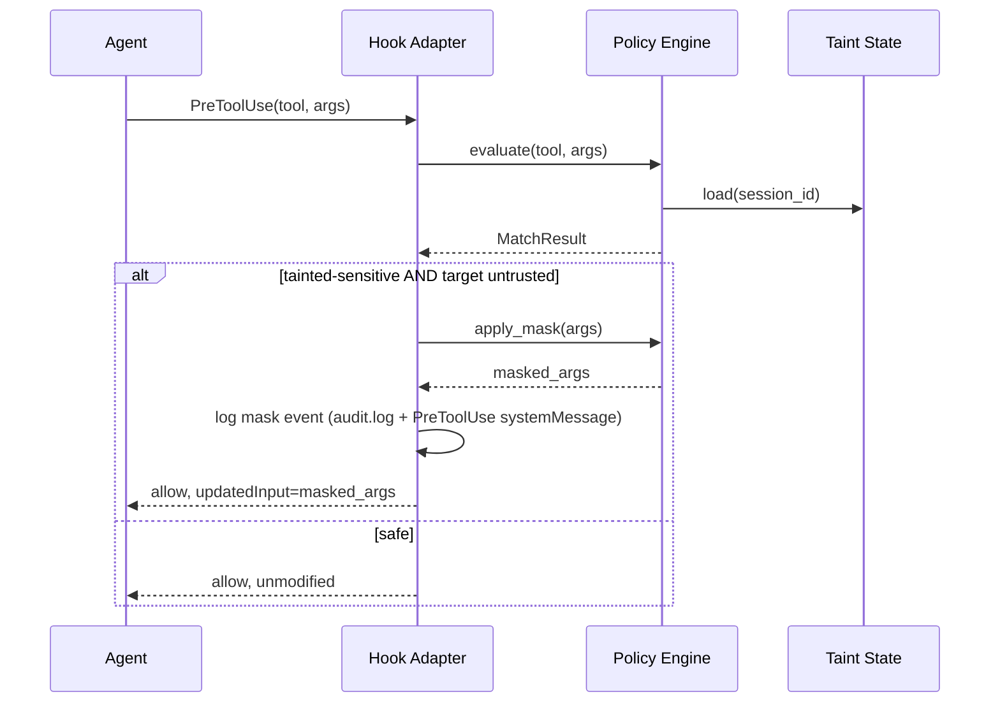
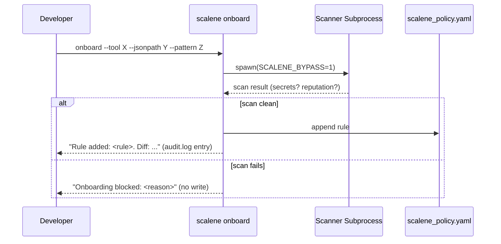

# Project Architecture (ARCH.md) — Project Scalene

Maintained by **Morpheus**. Status: Sprint 1 (§1-10) shipped 2026-07-09. Sprint 2 (§11) — Draft v1, pending Smith Gate 2.

## 1. System Overview

Scalene is a provenance-based DLP layer for AI coding agents. It sits between the agent harness (Claude Code, initially) and its tools, tracking where data came from and blind-masking payloads when tainted-sensitive data would flow to an untrusted destination. It has two layers:

- **Hook Adapter** — thin, harness-specific integration (v1: Claude Code `PreToolUse`/`PostToolUse` hooks).
- **Policy Engine** — harness-agnostic core: taint state machine, JSONPath rule matching, masking decision, onboarding.

Splitting these means porting to a second harness (Cursor, etc.) later is an adapter, not a rewrite.

## 2. Architectural Principles

- **Deterministic over probabilistic**: rule matching (JSONPath), not content/NLP inspection — keeps latency and behavior predictable (NFR: <15ms).
- **Fail-safe by default**: any ambiguity resolves to `sensitive=true, trusted=false` (BRD 2.4).
- **No daemon required**: stateless-process-per-hook-call model, state externalized to disk. Simpler to reason about, trivially portable across local/Docker/cloud (NFR-Portability) — no background service to manage or crash-recover.
- **Adapter isolation**: nothing in the policy engine imports or knows about Claude Code's hook JSON schema. The adapter translates in both directions.

## 3. Component Diagram

## 4. Class & Data Structures

## 5. Sequence & Interaction Flows

### Pre-tool-call (masking path)

### Onboarding

## 6. Technical Stack

- **Language**: Python 3.11+. Rationale: matches the surrounding tool ecosystem (`via` is pip-installed per this repo's own tooling), fast to iterate, `jsonpath-ng` and `pyyaml` cover the config/matching needs without custom parsing.
- **Distribution**: pip-installable CLI (`scalene-guard`), invoked as the hook `command` in `.claude/settings.json` (`hooks.PreToolUse[].hooks[].command`, `hooks.PostToolUse[].hooks[].command`).
- **State store**: flat JSON files under `.scalene/state/<session_id>.json`, file-locked (`filelock`) for the rare concurrent-call case. No database, no daemon.
- **Config**: `scalene_policy.yaml` at project root, loaded fresh per hook invocation (no caching across process boundaries — config is small, load cost is negligible against the 15ms budget).
- **Scanner isolation**: `subprocess.run` with `env={"SCALENE_BYPASS": "1", ...}`, not a container — keeps it portable to environments without container runtime access, while still preventing the scanner's own tool calls (if any) from re-entering the hook loop.

## 7. Resolved Open Questions (from Cypher's `docs/USER_STORIES.md`)

1. **Runtime/hook API target** → Claude Code's native `PreToolUse`/`PostToolUse` hook system for v1 (this is the same hook mechanism this very repo's session is running under). Policy engine kept adapter-isolated so Cursor/others can be added later without a rewrite.
2. **Taint state persistence** → Per-session JSON file keyed by Claude Code's `session_id` (present in every hook JSON payload), not in-memory/daemon. Survives individual hook subprocess exits; cleared on explicit reset or session end.
3. **Hook registration mechanism** → Standard Claude Code `settings.json` hook config (matcher + command), documented in project setup instructions (Neo to write during implementation).
4. **Threat-intel service for trust-list onboarding (STORY-501)** → **Decision: no paid external API in v1.** Ships with `LocalHeuristicChecker` (new/suspicious domain patterns, IP-literal targets, punycode homograph detection) behind a `ReputationChecker` interface. Removes the external-dependency/env-var concern Cypher flagged for Tank — reassess with Tank only if/when a real threat-intel API is added post-v1.

## 8. Response to Smith's Gate 1 Notes

- **STORY-401 masking visibility**: Adapter writes every mask event to `.scalene/audit.log` AND returns a Claude Code `systemMessage` in the PreToolUse hook response, so the event surfaces directly in the transcript the developer is watching — not just a silently swapped string. Cypher: please add this as explicit AC on STORY-401.
- **STORY-501 onboarding confirmation**: `scalene onboard` prints the rule added plus a YAML diff on success, and writes the same to `audit.log`. Cypher: please add as explicit AC on STORY-501.

## 9. Devops/Infra Impact (for Tank)

- STORY-601 (`SCALENE_BYPASS` env var) — confirmed as a subprocess env var, not a system-wide/CI env var. No CI pipeline changes needed for v1.
- STORY-501's original Tank flag (external threat-intel API) is **resolved** by decision #4 above — no external network egress in v1. Tank review still useful for confirming `.scalene/` directory placement doesn't collide with `.gitignore`/CI artifact rules, but is no longer a hard gate.

## 10. Refactoring Status & Technical Debt

None yet — greenfield. First implementation phase should establish the `PolicyEngine`/`Adapter` boundary early since it's the seam most likely to be tested by a second-harness port later.

---

## 11. Sprint 2 Architecture — Live Console (E7) & Secrets Scan Upgrade (E8)

### 11.1 Decision: TUI, not a web frontend

Cypher's stories left TUI-vs-web-frontend open. **Decision: TUI, built on `textual`.**

Reasons:
- A web frontend needs a bound localhost port and (likely) a small web-server dependency (Flask/FastAPI) — this project currently has zero web-server dependencies, and binding a port is exactly the kind of thing that would trigger a Tank infra review. A TUI reads local files directly and needs neither.
- The user's own framing was "a TUI or web frontend the user runs alongside their Claude session" — a terminal-native tool sits in the same terminal workflow a developer already has open; no browser tab, no localhost URL to remember (Nielsen #7, fewer things for the user to juggle).
- Matches the existing distribution model exactly: another `scalene` console-script subcommand (`scalene monitor`), same pip package, no new deployment surface.
- **Consequence: no Tank gate needed for Sprint 2** — no new port, service, env var, or CI/deploy impact. Same precedent as Sprint 1 (no Tank phase; reassess if this ever grows into a hosted/team-shared dashboard instead of a local single-developer tool).

**Packaging note:** `textual` is added as an optional extra (`pip install scalene-guard[monitor]`), not a hard dependency of the base package — the hot-path hook adapter (`scalene-guard`, <15ms NFR) must never import a TUI framework it doesn't use.

### 11.2 Data access: poll, don't watch

`.scalene/audit.log` and `.scalene/state/*.json` are read via simple polling (fixed interval, e.g. every 500ms — Neo to tune during implementation) rather than an inotify-style filesystem watcher. Reason: consistent with NFR-Portability (inotify-based watching is flaky on some Docker bind-mounts and network filesystems); the files are small, so poll cost is negligible; avoids a new dependency (`watchdog`) for a dev-only convenience tool.

### 11.3 Session scope (resolves Smith's Gate 1 note)

Every audit entry and state file already carries `session_id` (`hook_adapter.py:105`, `taint_state.py`). Decision: the console's default view lists all sessions with a discoverable state file (recent-first), each showing its own taint flags; selecting one filters the mask-event feed to that session. An aggregate "all sessions" feed is also available as a toggle — real developers commonly run more than one agent session at once, and neither "always merge" nor "always force a single-session pick" serves that alone.

**Cypher: please add this as explicit AC on STORY-701** (mirrors how Sprint 1's §8 response fed back into story AC).

### 11.4 Onboarding action (STORY-702)

The console's "apply" action is a **subprocess call to the existing `scalene onboard` CLI** using the exact `suggested_onboard_command` string already generated by `hook_adapter.py`, with the placeholder target substituted by the user's inline edit. This is a UI shell, not a reimplementation — it goes through the same secrets-scan/reputation-check gates as running the command by hand. No new code path in `onboard.py` itself.

### 11.5 Secrets scan upgrade (E8) — error message translation layer (resolves Smith's Gate 1 note)

`secrets_scan.py` already produces its own plain-language scan-result messages rather than surfacing regex internals. The `detect-secrets` integration must preserve that: detect-secrets' plugin/detector output is translated into the existing result format inside `secrets_scan.py`, never surfaced as raw library exception text to the onboarding CLI's user-facing output.

**Cypher: please add this as explicit AC on STORY-801.**
