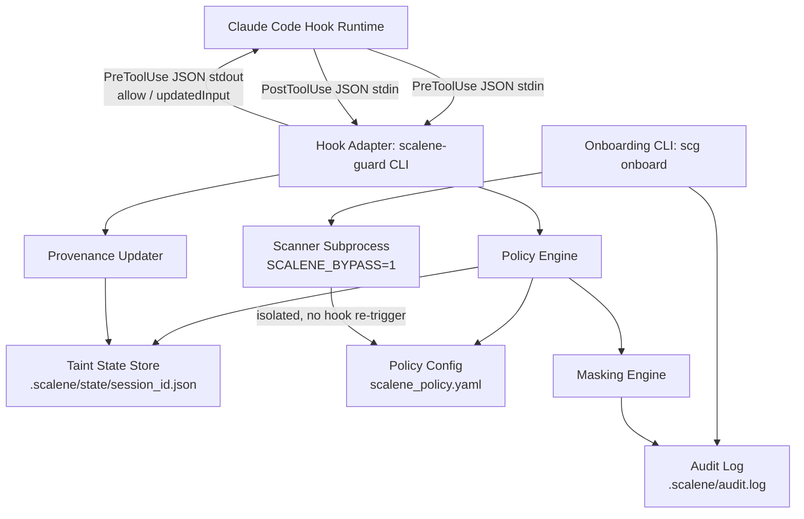
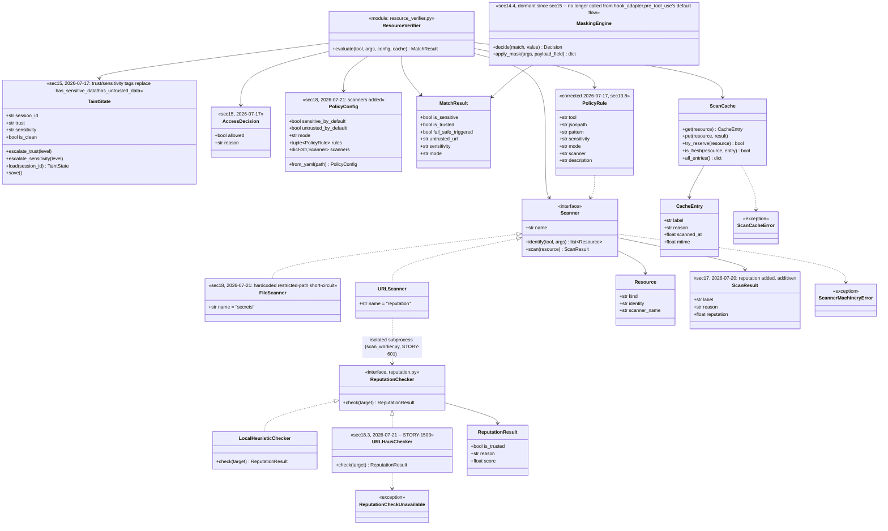
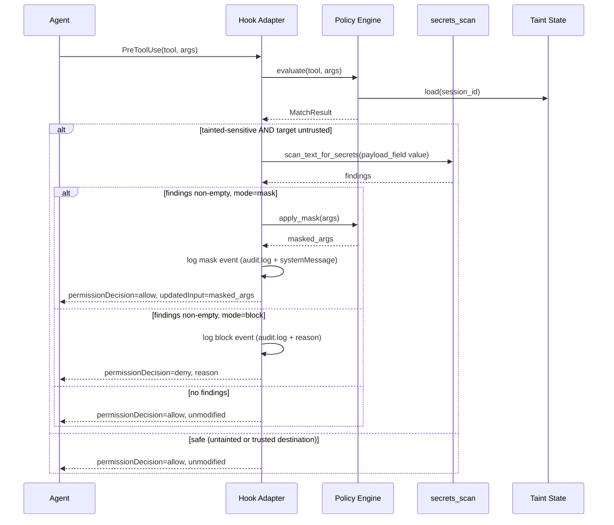
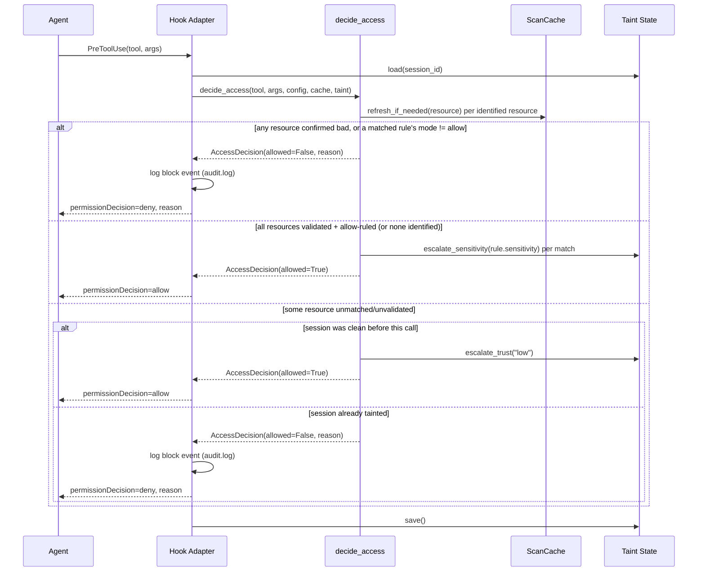
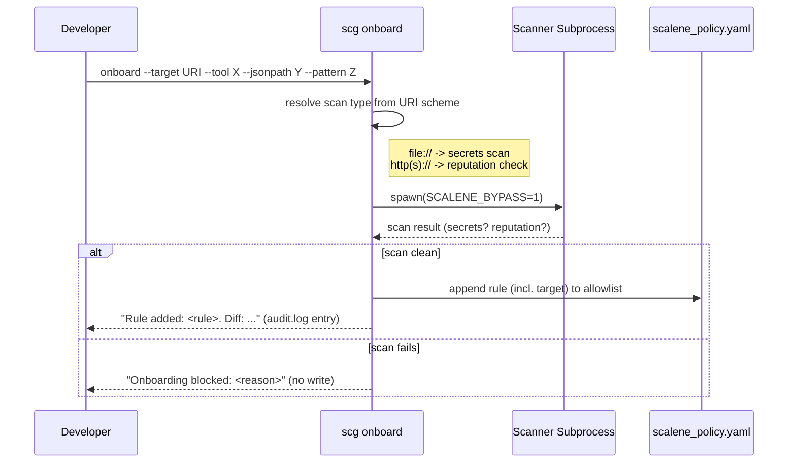

# Project Architecture (ARCH.md) — Project Scalene

Maintained by **Morpheus**. Status: Sprint 1 (§1-10) shipped 2026-07-09. Sprint 2 (§11) shipped 2026-07-10. Sprint 3 (§12) implemented 2026-07-14 (retro/launch pending). Sprint 4 (§13) — Draft v1, pending Smith Gate 2. **§4's class diagram predates §13 and will be revised during Sprint 4 implementation** (`PolicyRule`/`PolicyConfig.allowlist` are replaced per §13.1 — not reflected below yet, Neo to update alongside the code change).

## 1. System Overview

Scalene is a provenance-based DLP layer for AI coding agents. It sits between the agent harness (Claude Code, initially) and its tools, tracking where data came from and blind-masking payloads when tainted-sensitive data would flow to an untrusted destination. It has two layers:

- **Hook Adapter** — thin, harness-specific integration (v1: Claude Code `PreToolUse`/`PostToolUse` hooks).
- **Policy Engine** — harness-agnostic core: taint state machine, JSONPath rule matching, masking decision, onboarding.

Splitting these means porting to a second harness (Cursor, etc.) later is an adapter, not a rewrite.

## 2. Architectural Principles

- **Deterministic over probabilistic**: rule matching (JSONPath), not content/NLP inspection — keeps latency and behavior predictable (NFR: <15ms).
- **Fail-safe by default**: any ambiguity resolves to `sensitive=true, trusted=false` (BRD 2.4).
- **No daemon required**: stateless-process-per-hook-call model, state externalized to disk. Simpler to reason about, trivially portable across local/Docker/cloud (NFR-Portability) — no background service to manage or crash-recover.
- **Adapter isolation**: nothing in the policy engine imports or knows about Claude Code's hook JSON schema. The adapter translates in both directions.

## 3. Component Diagram



## 4. Class & Data Structures



**Full replacement, not incremental simplification (2026-07-15, Sprint 4 / E10, §13.1) — corrected 2026-07-17, §13.8:** the original `PolicyConfig.allowlist`/`PolicyRule` model (tool/jsonpath/pattern/target, matching a call *and* deciding trust in one step) was removed entirely at Sprint 4, on the reasoning that pattern-matching itself was structurally unsafe (one scan vouching for an unbounded future match). That reasoning was right about the *old* `PolicyRule`, but the replacement (host-only resource identity for URLs) reintroduced the identical defect in a different shape — see §13.1's revision note. `PolicyRule` returns in §13.8's corrected model, but doing a narrower job than before: it decides *candidacy and resource identity* (jsonpath + pattern, tool-shape-agnostic), never trust directly — the scan cache (`ScanCache`) still verifies and freshness-tracks each *distinct* matched identity, which is what keeps a wildcard `pattern` from vouching for anything it hasn't actually checked. `PolicyConfig` still carries the mode/sensitivity-by-default fallbacks used when no rule matches. `docs/BRD.md` is left as the original historical requirements doc, not updated to match — same treatment as `task.md`/`USER_STORIES.md`.

## 5. Sequence & Interaction Flows

### Pre-tool-call (access-control path)

**Superseded 2026-07-17 by sec15** — the diagram below is the historical record of §14.4's content-scanning/masking flow, kept for context, not silently rewritten. See the real current flow further down.

Response shape uses Claude Code's real `PreToolUse` hook contract
(`hookSpecificOutput.permissionDecision`/`updatedInput`/`permissionDecisionReason`)
— corrected 2026-07-14; a prior flat `{"allow": ..., "updatedInput": ...}`
shape was never part of that contract and was silently ignored by the real
harness. Masking/blocking is also content-gated (2026-07-14): provenance
(taint + untrusted destination) only decides whether to scan at all —
`secrets_scan.py` must actually find something before any action is taken.



**Current (sec15): `decide_access()` is the real flow.** No content scanning in the default path — the decision is entirely about whether identified resources are validated + explicitly allowed, or the session is still clean.



### Onboarding



## 6. Technical Stack

- **Language**: Python 3.11+. Rationale: matches the surrounding tool ecosystem (`via` is pip-installed per this repo's own tooling), fast to iterate, `jsonpath-ng` and `pyyaml` cover the config/matching needs without custom parsing.
- **Distribution**: pip-installable CLI (`scalene-guard`), invoked as the hook `command` in `.claude/settings.json` (`hooks.PreToolUse[].hooks[].command`, `hooks.PostToolUse[].hooks[].command`).
- **State store**: flat JSON files under `.scalene/state/<session_id>.json`, file-locked (`filelock`) for the rare concurrent-call case. No database, no daemon.
- **Config**: `scalene_policy.yaml` at project root, loaded fresh per hook invocation (no caching across process boundaries — config is small, load cost is negligible against the 15ms budget).
- **Scanner isolation**: `subprocess.run` with `env={"SCALENE_BYPASS": "1", ...}`, not a container — keeps it portable to environments without container runtime access, while still preventing the scanner's own tool calls (if any) from re-entering the hook loop.

## 7. Resolved Open Questions (from Cypher's `docs/USER_STORIES.md`)

1. **Runtime/hook API target** → Claude Code's native `PreToolUse`/`PostToolUse` hook system for v1 (this is the same hook mechanism this very repo's session is running under). Policy engine kept adapter-isolated so Cursor/others can be added later without a rewrite.
2. **Taint state persistence** → Per-session JSON file keyed by Claude Code's `session_id` (present in every hook JSON payload), not in-memory/daemon. Survives individual hook subprocess exits; cleared on explicit reset or session end.
3. **Hook registration mechanism** → Standard Claude Code `settings.json` hook config (matcher + command), documented in project setup instructions (Neo to write during implementation).
4. **Threat-intel service for trust-list onboarding (STORY-501)** → **Decision: no paid external API in v1.** Ships with `LocalHeuristicChecker` (new/suspicious domain patterns, IP-literal targets, punycode homograph detection) behind a `ReputationChecker` interface. Removes the external-dependency/env-var concern Cypher flagged for Tank — reassess with Tank only if/when a real threat-intel API is added post-v1.

## 8. Response to Smith's Gate 1 Notes

- **STORY-401 masking visibility**: Adapter writes every mask event to `.scalene/audit.log` AND returns a Claude Code `systemMessage` in the PreToolUse hook response, so the event surfaces directly in the transcript the developer is watching — not just a silently swapped string. Cypher: please add this as explicit AC on STORY-401.
- **STORY-501 onboarding confirmation**: `scg onboard` prints the rule added plus a YAML diff on success, and writes the same to `audit.log`. Cypher: please add as explicit AC on STORY-501.

## 9. Devops/Infra Impact (for Tank)

- STORY-601 (`SCALENE_BYPASS` env var) — confirmed as a subprocess env var, not a system-wide/CI env var. No CI pipeline changes needed for v1.
- STORY-501's original Tank flag (external threat-intel API) is **resolved** by decision #4 above — no external network egress in v1. Tank review still useful for confirming `.scalene/` directory placement doesn't collide with `.gitignore`/CI artifact rules, but is no longer a hard gate.

## 10. Refactoring Status & Technical Debt

None yet — greenfield. First implementation phase should establish the `PolicyEngine`/`Adapter` boundary early since it's the seam most likely to be tested by a second-harness port later.

---

## 11. Sprint 2 Architecture — Live Console (E7) & Secrets Scan Upgrade (E8)

### 11.1 Decision: TUI, not a web frontend

Cypher's stories left TUI-vs-web-frontend open. **Decision: TUI, built on `textual`.**

Reasons:
- A web frontend needs a bound localhost port and (likely) a small web-server dependency (Flask/FastAPI) — this project currently has zero web-server dependencies, and binding a port is exactly the kind of thing that would trigger a Tank infra review. A TUI reads local files directly and needs neither.
- The user's own framing was "a TUI or web frontend the user runs alongside their Claude session" — a terminal-native tool sits in the same terminal workflow a developer already has open; no browser tab, no localhost URL to remember (Nielsen #7, fewer things for the user to juggle).
- Matches the existing distribution model exactly: another `scg` console-script subcommand (`scg monitor`), same pip package, no new deployment surface.
- **Consequence: no Tank gate needed for Sprint 2** — no new port, service, env var, or CI/deploy impact. Same precedent as Sprint 1 (no Tank phase; reassess if this ever grows into a hosted/team-shared dashboard instead of a local single-developer tool).

**Packaging note:** `textual` is added as an optional extra (`pip install scalene-guard[monitor]`), not a hard dependency of the base package — the hot-path hook adapter (`scalene-guard`, <15ms NFR) must never import a TUI framework it doesn't use.

### 11.2 Data access: poll, don't watch

`.scalene/audit.log` and `.scalene/state/*.json` are read via simple polling (fixed interval, e.g. every 500ms — Neo to tune during implementation) rather than an inotify-style filesystem watcher. Reason: consistent with NFR-Portability (inotify-based watching is flaky on some Docker bind-mounts and network filesystems); the files are small, so poll cost is negligible; avoids a new dependency (`watchdog`) for a dev-only convenience tool.

### 11.3 Session scope (resolves Smith's Gate 1 note)

Every audit entry and state file already carries `session_id` (`hook_adapter.py:105`, `taint_state.py`). Decision: the console's default view lists all sessions with a discoverable state file (recent-first), each showing its own taint flags; selecting one filters the mask-event feed to that session. An aggregate "all sessions" feed is also available as a toggle — real developers commonly run more than one agent session at once, and neither "always merge" nor "always force a single-session pick" serves that alone.

**Cypher: please add this as explicit AC on STORY-701** (mirrors how Sprint 1's §8 response fed back into story AC).

### 11.4 Onboarding action (STORY-702)

The console's "apply" action is a **subprocess call to the existing `scg onboard` CLI** using the exact `suggested_onboard_command` string already generated by `hook_adapter.py`, with the placeholder target substituted by the user's inline edit. This is a UI shell, not a reimplementation — it goes through the same secrets-scan/reputation-check gates as running the command by hand. No new code path in `onboard.py` itself.

### 11.5 Secrets scan upgrade (E8) — error message translation layer (resolves Smith's Gate 1 note)

`secrets_scan.py` already produces its own plain-language scan-result messages rather than surfacing regex internals. The `detect-secrets` integration must preserve that: detect-secrets' plugin/detector output is translated into the existing result format inside `secrets_scan.py`, never surfaced as raw library exception text to the onboarding CLI's user-facing output.

**Cypher: please add this as explicit AC on STORY-801.**

## 12. Sprint 3 Architecture — Documentation & Onboarding (E9)

STORY-901/902 are pure documentation — no new architecture decisions, just placement:

- `docs/GETTING_STARTED.md` and `docs/USER_GUIDE.md` are new top-level docs under `docs/`, added to `README.md`'s documentation table (per Smith Gate 1). `README.md`'s existing "Getting started" section is trimmed to a link, not a duplicate.
- STORY-902's CLI reference must be generated/verified against real `--help` output (`scg --help`, `scg onboard --help`, `scg monitor --help`, `scg install-hooks --help`, `scalene-guard --help`) at write time — Neo checks this by actually running each command, not transcribing from memory of the source.
- Per Smith's Gate 1 note: the onboard-suggestion workflow (`_suggest_onboard_command()`, §4/§11.4) must be the guide's primary onboarding path, with the raw manual-flag `scg onboard` invocation presented as the fallback for cases with no prior blocked call to suggest from.

### 12.1 Decision: demo is a real `scalene-guard` subprocess run, not a mocked walkthrough

STORY-903 requires the demo show a *real* masked call, offline, and be checked by a test so it can't rot silently. Decision: a small script (`demo/run_demo.py`) that:

1. Builds a temp project dir with a minimal `scalene_policy.yaml` (no sensitive allowlist, no trusted sources — matches the fail-safe defaults new users actually hit first).
2. Invokes the real `scalene-guard` CLI as a subprocess, feeding it real `PreToolUse`/`PostToolUse` JSON payloads on stdin exactly as Claude Code would (same entry point as production, per §1's adapter-isolation principle — this is not a call to internal functions that could drift from the real CLI contract).
3. Scenario matches the BRD's Triangle-of-Doom case directly: a `Read` of a fake "sensitive" file (sets `has_sensitive_data`), followed by a `WebFetch` to a domain that is not on the trust list (untrusted destination) — the second call's response shows the payload masked.
4. Prints each step with plain-language narration (what happened and why) so it reads as a demo, not raw JSON — but the underlying JSON is real `scalene-guard` output, not fabricated for display.

**Why this stays offline (STORY-903 AC):** `scalene-guard` never performs the tool call itself — it only returns an allow/mask decision (§1, hook adapter is decision-only). The demo never actually issues the `WebFetch` HTTP request; showing the masked `tool_input`/response *is* the entire demonstration. No mocking is needed to keep this offline — it's a structural property of the architecture, not a demo-specific shortcut.

### 12.2 Decision: demo is tested, not just runnable

`tests/test_demo.py` invokes `demo/run_demo.py` as a subprocess (same as a user would) and asserts the final output matches the demo's real, current behavior. This runs under ordinary `pytest`/`make test` collection — no separate CI wiring needed. `make demo` (new Makefile target) runs the same script directly for a human to watch, narration included.

**2026-07-16 (direct user request, post-Sprint-4):** the demo was extended beyond the single masked-call scenario to demonstrate the actual security-model contrast — mask (default) vs. a verified-trusted destination vs. `mode: block` — using the real `scg onboard` CLI and a real `mode: block` policy file, not just the original zero-config mask case. This means "the fake secret never appears unmasked" is **no longer a whole-demo invariant**: Part 3 deliberately shows the same fake secret passing through *unmasked* to a destination that's been onboarded/verified trusted, since that's the concrete, honest way to demonstrate that trust is an exemption from content-scanning, not an additional layer of detection. `tests/test_demo.py`'s assertions were updated accordingly (the "never unmasked" check is now scoped to Part 2's specific line, not the whole output).

**No Tank gate needed:** no new service, port, env var, or deploy/CI impact — `demo/run_demo.py` is a local dev-only script in the same vein as Sprint 1/2's no-Tank precedent.

## 13. Sprint 4 Architecture — Extensible Scanner Registry & Resource Verification (E10)

### 13.1 Decision: replace the allowlist/PolicyRule matching model, don't bolt scanning on top of it

**Corrected 2026-07-17 (direct user design session, post-Sprint-4-close) — see §13.8.** The paragraph below is kept as the historical record of what shipped and why it was wrong, not silently rewritten. The specific error: claiming host-only resource identity "doesn't lose" the old model's flexibility. It does, and worse — host-level identity **structurally reproduces the exact defect this epic exists to fix** (one verification vouching for an unbounded future set), just relocated from a user-authored regex into the resource-identity model itself. Trusting a host based on scanning one path under it is the same shape of bug as a `pattern` matching an unbounded set based on scanning one `target`. §13.8 corrects this: `PolicyRule` (jsonpath + pattern) returns as the *matching* mechanism — generic across any tool's argument shape, not assuming a fixed per-tool-type resource schema — while the scan cache's per-distinct-identity verification and freshness tracking (§13.3, which was and remains correct) is what actually keeps a wildcard pattern safe: the pattern controls *candidacy*, the cache still controls *trust*, checked per specific match, not once for the whole pattern.

Cypher's epic left this as an explicit open question. **Decision: full replacement**, not coexistence. `PolicyConfig.allowlist`/`PolicyRule` (tool/jsonpath/pattern/target, shipped one commit before this epic) is removed entirely, not deprecated alongside a new system.

Reasoning: the defect this epic exists to fix — a rule's `pattern` can match an unbounded future set while its `target` was only ever scanned once — is structural to the pattern-matching model itself, not a bug in one implementation of it. Any coexistence would keep the hole open for whichever rules stay on the old path. The new model's resource-identity granularity (a URL scanner's resource is a *host*, not a full URL) already gives broad, reusable coverage — "trust `internal.example.com`" naturally covers every path under it — without needing a hand-written regex to express "broad." The old model's flexibility isn't lost, it's absorbed into resource-identity choice.

`scg onboard` is **not removed** — it's re-scoped from "write a policy rule" to "pre-seed the resource cache" (§13.4): given a target, run the matching scanner against it right now and write the result into the same cache the live hook consults, so a developer can front-load the first-sighting cost for a resource they already know is fine, instead of eating it the first time an agent hits it live.

### 13.1.1 How this fits into the existing `pre_tool_use`/`post_tool_use`/`MaskingEngine` flow

Two *different* checks exist today and stay separate — this epic replaces one of them, not both:

1. **Content-gating (shipped, unrelated to this epic):** `MaskingEngine.decide()` scans the *specific payload value being sent* (e.g. an outbound `prompt`) for embedded secrets via `scan_text_for_secrets()`, gated behind provenance risk. This governs *whether to mask/block this specific call*. **Unchanged by E10.**
2. **Resource verification (this epic, replaces `PolicyConfig.evaluate()`):** governs the *provenance signals themselves* — `is_sensitive` (does a `Read`'s target count as sensitive) and `is_trusted` (does a call's destination count as trusted). Previously computed by matching `PolicyRule`s; now computed by asking the scanner registry to identify resources in the call's args and checking the resource cache.

Concretely, `hook_adapter.py` changes from `match = config.evaluate(tool, args)` to something like `match = resource_verifier.evaluate(tool, args)`, returning the same `MatchResult(is_sensitive, is_trusted, fail_safe_triggered)` shape both `pre_tool_use` and `post_tool_use` already consume — `MaskingEngine.decide()`'s signature and content-gating logic don't change at all. `fail_safe_triggered` now means "at least one identified resource had no cache entry and fell back to defaults," replacing its old meaning ("a rule's JSONPath failed to evaluate") — same field, same downstream handling (existing tests/log messages), new trigger condition.

### 13.2 Component: Scanner protocol + registry

```python
class Scanner(Protocol):
    name: str  # "secrets", "reputation", ... — the label namespace this scanner owns

    def identify(self, tool_name: str, args: dict) -> list[Resource]:
        """Find candidate resources this scanner cares about within a call's
        args. No jsonpath/pattern from user config — each scanner owns its
        own detection logic (STORY-1002)."""

    def scan(self, resource: Resource) -> ScanResult:
        """Verify one resource. Runs in an isolated subprocess (SCALENE_BYPASS=1,
        unchanged from today's subprocess_isolation.py) — never raises to the
        caller; a scanner-internal exception is what makes STORY-1004's fatal
        path fire, not what gets returned as a ScanResult."""

@dataclass(frozen=True)
class Resource:
    kind: str          # "file" | "url" — extensible, not a closed enum
    identity: str       # cache key material: absolute path, or host
    scanner_name: str

@dataclass(frozen=True)
class ScanResult:
    label: str          # "public" | "sensitive" | "trusted" | "untrusted"
    reason: str = ""
```

Registry is a plain `dict[str, Scanner]` populated at import time (`SCANNERS = {"secrets": FileScanner(), "reputation": URLScanner()}`) — adding a scanner is adding an entry, no dispatch code changes (STORY-1002 AC).

**Built-in scanners (STORY-1002):**
- `FileScanner` — `identify()` checks known per-tool fields first (`Read`/`Write`/`Edit`'s `file_path`/`new_string`/`content`-adjacent path arguments, reusing today's `DEFAULT_PAYLOAD_FIELDS`-style knowledge internally, not exposed to config) plus a generic "does this string look like an absolute/relative path" regex fallback for anything else. `scan()` is today's `secrets_scan.py` unchanged, run against the file's content.
- `URLScanner` — `identify()` checks known fields (`WebFetch`'s `url`) plus a generic `https?://` regex fallback. Resource identity is the **host**, not the full URL (§13.1). `scan()` is today's `LocalHeuristicChecker` unchanged.
- **Bash command scanner: not a third scanner type.** Decision: `Bash`'s `command` string is handed to *both* `FileScanner.identify()` and `URLScanner.identify()`'s generic fallback regexes as an additional input source, since a shell command is just a string that may embed either shape. A dedicated `BashScanner` would only duplicate the same shape-detection regexes FileScanner/URLScanner already need for their generic fallback — no new scanner type needed, just wiring `Bash` into both existing scanners' `identify()`.
- Named regex captures (STORY-1001) are an internal detail of each scanner's own detection regex (e.g. `URLScanner`'s fallback pattern has a `(?P<host>...)` group it extracts and discards the rest of) — not a user-facing config concept. There is no more user-authored `jsonpath`/`pattern` for this purpose at all (§13.1).

### 13.3 Component: Scan cache

`.scalene/scan_cache.json`, project-wide (not per-session — a file's or host's verification status isn't session-scoped), file-locked like `taint_state.py`'s per-session files (`filelock`, same pattern, not a new dependency):

```json
{
  "file:///abs/path/to/file.md": {"mtime": 1720000000.0, "label": "public", "reason": "", "scanned_at": 1720000000.0},
  "reputation:internal.example.com": {"label": "trusted", "reason": "", "scanned_at": 1720000000.0}
}
```

Key is `f"{scanner_name}:{resource.identity}"` (file resources additionally carry `mtime` inside the value, not the key, since re-verifying a changed file should overwrite its entry rather than accumulate stale ones per-mtime).

**Lookup/refresh logic (STORY-1003), run for every identified resource on every call:**

| Cache state | Label used for *this* call | Rescan? |
|---|---|---|
| No entry | Existing fail-safe default (`sensitive_by_default`/`untrusted_by_default`) — **identical to today's behavior for an unconfigured resource, no new latency** | Fire-and-forget background scan, seeds cache for next time |
| Fresh (<24h, and for files: `mtime` unchanged) | Cached label, direct | None |
| Expired (>24h, or file `mtime` changed) | Last-known cached label, immediate, no blocking | Fire-and-forget background scan, refreshes cache |

This is why the "new resource" path is *not* a regression risk for the **decision** it produces: it applies exactly the same fail-safe default today's code does, so the label a caller acts on never changes. Only the *previously-scanned* paths get faster than fail-safe defaults, and only once something has actually been verified.

**NFR revision, 2026-07-14 (Morpheus's Phase 2 review, informed by real measurement, not assumption):** the "zero added latency" framing above was wrong about *wall-clock cost*, only right about *decision behavior*. `refresh_if_needed()`'s fire-and-forget `subprocess.Popen` spawn (the "merely adds a side-effect" step) is not free — measured at ~6.6ms avg / ~16ms max per newly-identified resource in this environment, isolated to the spawn syscall itself (reproduced identically with a trivial no-op command, ruling out worker-script complexity as the cause).

Splitting the NFR to be honest about this rather than letting Phase 3's perf test discover it as a surprise:
- **`NFR-Perf-Steady-State`** (unchanged, <15ms): applies whenever every identified resource in a call has a fresh cache entry — pure JSON-cache reads under a `FileLock`, no subprocess spawn, genuinely the same cost as today's pre-Sprint-4 code.
- **`NFR-Perf-FirstSighting`** (new, provisional): a call that identifies N never-before-seen (or expired) resources pays roughly N × spawn-cost in *added* latency on top of the steady-state cost, since each triggers its own dedup-checked `Popen` spawn. Provisional budget: **<25ms added latency per newly-identified resource** (headroom over the measured ~16ms worst case). This is a one-time cost per resource — paid once, then the resource is cache-fresh for 24h and falls back under `NFR-Perf-Steady-State` for every subsequent call. Phase 3 task 3.4 must verify this NFR with a real test (analogous to `tests/test_performance.py`'s existing steady-state test), not assume the provisional number holds — same "verify, don't assume" standard as the hook-contract exit-code work.
- Accepted deliberately over redesigning the spawn mechanism (e.g., batching multiple resources into one spawn, or decoupling from the synchronous `pre_tool_use` path) — the added cost is one-time-per-resource and self-amortizing (every subsequent call on that resource is free), judged not worth the added design complexity for a per-resource cost this bounded.

**"Background" mechanism:** `subprocess.Popen` (not `subprocess.run`) with no `.wait()` — the child scanning process (running with `SCALENE_BYPASS=1`, same isolation as today) writes its result into the cache file (via the same `FileLock`) whenever it finishes, independent of the parent `scalene-guard` process having already exited and returned its response. No daemon, no persistent process — consistent with §2's "no daemon required" principle; each background scan is a one-shot detached subprocess, same lifecycle model as everything else in this codebase.

**File staleness uses `mtime`, not a content hash** (Smith/user direction) — `os.stat().st_mtime` is effectively free; hashing file content on every call would reintroduce the exact performance problem this cache exists to solve.

### 13.4 `scg onboard` re-scoped: pre-seed the cache

```
scg onboard --target file:///path/to/file.md
scg onboard --target https://internal.example.com
```

Drops `--tool`/`--jsonpath`/`--pattern`/`--description` entirely (§13.1 — there's no rule to author anymore, just a resource to check now instead of later). Resolves the scanner from the URI scheme exactly as today (`file://` → `FileScanner`, `http(s)://` → `URLScanner`), runs `scan()` synchronously (this is the one deliberately-blocking scan path left in the system, and it's fine — it's a one-off CLI invocation, not the hot hook path), and writes the result into `.scalene/scan_cache.json` directly. No more separate `scalene_policy.yaml` `allowlist` writes, no diff-printing (there's no YAML edit to diff) — prints the resolved label instead.

### 13.5 STORY-1004: fatal exit — exact boundary and mechanism

**Fail-safe-exit-0 (unchanged from today):** malformed hook JSON, unrecognized hook event, a scanner's `identify()`/`scan()` returning an ordinary bad result (secret found, bad reputation) — all ordinary decisions, `scalene-guard` exits 0 exactly as it does today.

**Fatal-exit-nonzero (new, narrow):** the scan **cache store itself** is unreadable/corrupted/unwritable, or a registered scanner's `scan()`/`identify()` raises an unhandled exception (a bug in scanner code, not a scan finding). This is a "the safety mechanism can't do its job" condition, categorically different from "the safety mechanism did its job and found something."

**Exit code: verified as 2** (2026-07-15, Neo — not assumed, not left provisional). Checked two ways: (1) fetched Claude Code's real hook docs, which are explicit — "Claude Code treats exit code 1 as a non-blocking error and proceeds with the action, even though 1 is the conventional Unix failure code... only exit code 2 blocks [PreToolUse]"; (2) live-verified against this very repo's own dogfooded `scalene-guard` installation (`.claude/settings.json` wires the real, editable-installed binary as this session's actual hook) — corrupted the real `.scalene/scan_cache.json`, confirmed a real tool call passed through completely unaffected while the fatal path returned exit 1, then confirmed exit 2 is what's actually required to block a `PreToolUse` call. The architecture's original caution above (don't assume exit 2's semantics carry over from the earlier hook-contract research) was a reasonable question to raise, but the real contract doesn't distinguish "deliberate policy block" from "machinery failure" by cause — it only cares about the exit code value. Exit 2 is used uniformly for both `PreToolUse` (where it correctly blocks — the fail-closed behavior this story wants: if the scanning machinery can't be trusted, stop the call rather than let it through unchecked) and `PostToolUse` (where exit 2 is explicitly non-blocking too, same as any other non-zero code, which is correct since the tool has already run by then).

**Message:** same plain-language standard as `secrets_scan.py`/`onboard.py` — a fatal exit still writes a real reason to stderr, never a raw traceback (Smith Gate 1 note).

**Labels always surfaced regardless of fatal/non-fatal:** whatever labels *did* resolve for other resources in the same call (e.g. one resource's scanner is fine, another's cache store lookup is what failed) are still included in the response — a fatal condition on one resource doesn't blank out information that was actually available.

### 13.6 STORY-1005: recent scans surfaced in `scg monitor`

New panel alongside the existing Sessions/Mask-events tables (`monitor_app.py`), reading `.scalene/scan_cache.json` directly (poll-based, same §11.2 precedent — no filesystem-watch dependency). Columns: resource identity, label, last-scanned time. This is a read of the real cache store, not a parallel summary that could drift from it (STORY-1005 AC).

### 13.7 Devops/Infra impact

No Tank gate: still no daemon, no new port/service/env var. The one new behavior worth Tank's awareness (not a gate) is background subprocess spawning via `Popen` without `wait()` — confirm this doesn't leave zombie/orphaned processes in constrained container environments; Neo to verify during implementation with a real, repeated-invocation test, not just a single-call check.

### 13.8 Correction (2026-07-17): rule-driven resource identity, and an explicit trust/sensitivity model

Direct user design session, after Sprint 4 was formally closed. Corrects §13.1's resource-identity decision and generalizes it — not a new epic replacing E10, an in-place fix to a defect in what E10 shipped.

**What was wrong.** §13.1 hard-codes what "a resource" means per scanner type: `FileScanner`'s identity is the full path (correct), `URLScanner`'s identity is the *host* (wrong). Host-level identity means onboarding one path under a host (e.g. `github.com/you/your-repo`) silently trusts every other path under that host (e.g. anyone else's repo on `github.com`) — one verification vouching for an unbounded set, the exact defect this epic exists to close, just relocated into the resource model instead of a user-authored regex.

**Why it matters more than "less granular than ideal."** The user framed Scalene's primary purpose precisely: mitigating prompt-injection/tool-poisoning vectors without relying on the model's own guardrails, *not* secret-leak prevention — that's the secondary, emergent protection that falls out of the taint-tracking/content-scanning machinery. Under that priority order, **trust is the primary control** (should the agent be allowed to pull content from this source at all) and **masking is the backup** (catch it if something sensitive slips out anyway). Host-level trust granularity is therefore a hole in the *primary* control, not the backup one: `github.com` hosts both a trusted repo and every untrusted, potentially-poisoned repo anyone else has ever pushed, and host-level identity cannot distinguish them.

**Two independent axes, not one.** Prior to this correction, `is_sensitive`/`is_trusted` were treated as roughly parallel provenance signals. They are not — they answer different questions:
- **Trust** — *could this source cause the agent to do something malicious* (prompt injection, tool poisoning)? A read-side/source-legitimacy question, answered by scanning/verifying/vouching for a resource, at whatever granularity actually distinguishes the safe case from the unsafe one (per-repo, not per-host, for anything multi-tenant like a public git host).
- **Sensitivity** — *what's the blast radius if a malicious tool call involving this resource succeeds?* A data-classification question, independent of trust. Exactly three levels, deliberately small:
  1. **Public** — anyone in the world can access it.
  2. **Internal Only** — anyone internal to the org can access it.
  3. **Restricted** — only specific people can see it.

  It's fine to work with low- or medium-trust sources when sensitivity is Public/non-critical — the worst case is bounded. The dangerous combination (the "Triangle-of-Doom"/lethal-trifecta case this whole project exists to prevent) is low-trust *and* high-sensitivity together, not either alone.

**Masking becomes unconditional, not sensitivity-gated.** Today, content-scanning only runs when a session is already tainted-sensitive *and* tainted-untrusted (`MaskingEngine.decide()`'s `provenance_risk` gate). Under the corrected model, an implicit, always-present top-level rule —

```yaml
- tool: ".*"        # any tool
  jsonpath: "$.*"    # any argument (conceptual; exact JSONPath TBD at implementation)
  pattern: ".*"      # any value
  sensitivity: public
  mode: mask
```

— matches every call by default, so real-secret content-scanning is a universal baseline, not conditioned on classification. This is what makes `sensitivity: public` a safe *default* rather than a weakening: the leak-detection safety net no longer depends on the classification being right. Sensitivity/trust govern *stricter* handling on top of that baseline (e.g. a rule matching something classified `restricted` can carry `mode: block` instead of `mask`), not whether any protection exists at all.

**`PolicyRule` returns, generalized — not the pre-Sprint-4 shape.** The pre-Sprint-4 `PolicyRule` matched calls directly and *was itself* the trust decision (evaluate → allow/deny), which is what let one scan vouch for an unbounded pattern. The corrected model splits that: `PolicyRule` (jsonpath + pattern, tool-shape-agnostic — Scalene does not need to know a given tool's argument structure in advance) decides *candidacy and resource identity* (a named capture group in `pattern`, generalizing STORY-1001's original — not Phase 1's internal-only downgrade of it — intent, becomes the cache key); the scan cache (§13.3, unchanged and still correct) decides *trust*, verified and freshness-tracked per distinct identity a rule's pattern actually matches, never once for the whole pattern. A wildcard rule widens what's *considered*, never what's *vouched for without checking*.

```python
@dataclass(frozen=True)
class PolicyRule:
    tool: str          # regex against tool_name (".*" = any)
    jsonpath: str       # JSONPath into tool_input/tool_response
    pattern: str        # regex against the extracted value; named capture groups
                        # (e.g. (?P<host>...)) become the resource identity
    sensitivity: str    # "public" | "internal" | "restricted"
    mode: str           # "mask" | "block"
    scanner: str = ""   # which verifier checks a match ("secrets" | "reputation" |
                        # inferred from context if omitted)
    description: str = ""
```

**Zero-config baseline is preserved, not replaced.** `FileScanner`/`URLScanner`'s built-in generic-fallback detection (Phase 1, unaffected) remains the reason a brand-new, unconfigured project gets real protection immediately — rules are an *additive precision layer* (narrower or broader than the generic heuristic, deliberately chosen) layered on top of that baseline via the implicit default rule above, not a configuration requirement before any scanning happens.

**Not yet decided / explicitly deferred to implementation:** the exact JSONPath expression for "any argument" in the default rule; whether `scanner` must always be explicit on a user-authored rule or can be inferred the way URI scheme inference works today; the real on-disk schema for `PolicyRule` in `scalene_policy.yaml` (replaces the removed `allowlist`, does not resurrect its exact pre-Sprint-4 shape — `sensitivity`/`mode` are new fields, `target` does not return); how `scg onboard` maps a `--target` onto a generated rule with a sensible default pattern. This section documents the corrected *model*; implementation is a follow-up phase, not retroactively applied to already-closed Sprint 4 code without going through the same Bloop review process everything else in this document did.

## 14. Sprint 5 Architecture — Trust/Sensitivity Model & Rule-Driven Resource Identity (E11)

Resolves §13.8's 4 deferred open questions and STORY-1101 through 1105. Grounded in the real shipped E10 code (`scanner.py`, `policy_config.py`, `resource_verifier.py`, `masking.py`, `onboard.py`, `scan_cache.py`), not a rewrite from a blank page — this section states exactly what changes and what stays.

### 14.1 Rules layer *on top of* scanner identification — they do not replace it

Resolves open question #1 (exact JSONPath for "any argument"). §13.8's `PolicyRule` describes `jsonpath` as extracting a value from `tool_input`/`tool_response` directly, which would mean rules do their own independent resource discovery — duplicating what `FileScanner`/`URLScanner`'s `identify()` already does today, and reopening the exact "zero-config baseline preserved" promise §13.8 itself makes a few paragraphs earlier.

**Decision:** rules do not re-derive resources from raw args. `identify()` (unchanged, Phase 1) still finds every candidate `Resource` for a call. A rule's job is purely classification: for each identified `Resource`, find the first rule (in declaration order) where `tool` (regex) matches `tool_name` and `pattern` (regex) matches `resource.identity` — that rule's `sensitivity`/`mode` apply to this resource for this call. The implicit default rule (§13.8, any tool/any value, `sensitivity: public`, `mode: <defaults.mode>`) always matches last, as a fallback, not a real `PolicyRule` requiring JSONPath evaluation — it is constructed in code, never written to a user's YAML (a magic always-on YAML entry could be accidentally deleted; a code-level fallback cannot). This closes open question #1 by making it moot for the default case: `jsonpath` remains a documented field on `PolicyRule` for a future case where a tool has multiple candidate argument fields that need distinguishing, but is not required for E11's scope — omit it and the rule matches any resource the `tool`+`pattern` pair identifies.

**Resolves open question #2 (`scanner` explicit vs. inferred):** inferred by default. Every identified `Resource` already carries `scanner_name` (which scanner found it). A rule's optional `scanner` field is a disambiguating filter only — if present, the rule additionally requires `resource.scanner_name == rule.scanner`; if absent, the rule applies to any resource whose `tool`+`pattern` match, regardless of which scanner identified it. This matters only for the rare case where a file-shaped and URL-shaped string could both plausibly match the same `pattern` (e.g. a Bash command).

### 14.2 Fix STORY-1101: `URLScanner` identity becomes per-URL, not per-host

The defect: `URLScanner.identify()` (§13.2) extracts a `host` capture group as the resource identity. Scanning `https://github.com/you/your-repo` once and caching `reputation:github.com -> trusted` silently trusts `https://github.com/anyone/anything-else` forever after — one verification vouching for an unbounded set.

**Fix:** `_URL_FALLBACK_RE` changes from `https?://(?P<host>[^/\s:"']+)` to capture the full URL span (scheme + host + path, query string dropped to keep cache keys bounded — `https?://(?P<url>[^\s:"']+)`, trimmed of a trailing `?...`). `Resource.identity` for a URL becomes this full (scheme, host, path) string, not the bare host. Every distinct path is now its own cache entry, independently scanned and freshness-tracked (§13.3's cache mechanics are otherwise unchanged) — the exact fix the defect calls for.

**Broadening remains possible, but only via an explicit rule, never implicitly.** A developer who genuinely wants "trust everything under `internal.example.com`" writes:
```yaml
rules:
  - tool: ".*"
    pattern: "https://internal\\.example\\.com/.*"
    sensitivity: internal
    mode: mask
```
This rule's `pattern` only decides *candidacy* — which resources it's willing to consider trusted-if-verified. The scan cache still verifies and freshness-tracks each *distinct* URL this pattern actually matches (§13.3, unchanged) — a wildcard rule widens what's considered, never what's vouched for without a real per-resource cache entry. This is the generalized version of the same fix, available to any scanner type, not just URLs.

### 14.3 `scg onboard --target` stays single-flag (Smith's Gate 1 hard requirement, carried to Gate 2)

**Decision: `scg onboard`'s CLI surface does not change.** It still takes exactly `--target <uri>`, verifies that one exact resource (now per-URL under 14.2's fix, same behavior as today for `file://` targets since those were already full-path identity), and pre-seeds the cache — no `--pattern`/`--sensitivity`/`--mode` flags added. This is the common case (§13.4, unaffected) and Smith's explicit condition for Gate 2 approval: the onboarding simplicity E10 shipped does not regress.

Authoring a `PolicyRule` (broader pattern, explicit `sensitivity`/`mode`) is the separate, opt-in power-user path for the two cases `--target` alone can't express: (a) trusting more than one exact resource at a time, (b) setting `sensitivity`/`mode` to anything other than the project-wide `defaults.mode`. A rule is hand-written into `scalene_policy.yaml` directly, same as the pre-Sprint-4 `allowlist:` editing model — this is deliberately not automated by a CLI flag in this epic (no evidence yet that it's the common case; add a `scg rule add` convenience command later if usage shows otherwise, not speculatively now).

### 14.4 `MatchResult` gains `sensitivity`/`mode`; `MaskingEngine` scanning becomes unconditional (STORY-1102, 1103, 1104)

`resource_verifier.evaluate()` (currently returns `MatchResult(is_sensitive, is_trusted, fail_safe_triggered)`) gains two fields:
```python
@dataclass(frozen=True)
class MatchResult:
    is_sensitive: bool          # unchanged: FileScanner's literal secret-content detection (taint tracking)
    is_trusted: bool            # unchanged in meaning, now computed at per-URL identity (14.2)
    fail_safe_triggered: bool = False
    sensitivity: str = "public"  # NEW: resolved from the matching PolicyRule (14.1), 3 levels
    mode: str = "mask"           # NEW: resolved from the matching PolicyRule, "mask" | "block" | "allow" (14.4 amendment)
```
`is_sensitive`/`is_trusted` keep their exact current meaning and taint-tracking role (`post_tool_use` → `taint.mark_sensitive()`/`mark_untrusted()`, still read by `scg monitor`'s Sessions panel — unaffected by this epic). `sensitivity`/`mode` are the new, independent axis (§13.8) resolved once per call by taking the *most specific single rule match* across all of a call's identified resources — if resources disagree (rare: a call touching two resources with different rule matches), the most restrictive `mode` (`block` over `mask`) and most restrictive `sensitivity` (`restricted` > `internal` > `public`) wins, matching the existing ANY-match-wins-conservative convention `evaluate()` already uses for `is_sensitive`/`is_trusted`.

**`MaskingEngine.decide()` changes** (STORY-1104 — this is the behavior change users will actually notice):
```python
def decide(self, match: MatchResult, value: Any) -> Decision:
    if value is None:
        return Decision(action="allow")
    findings = tuple(scan_text_for_secrets(str(value)))
    if not findings:
        return Decision(action="allow")
    return Decision(action="block" if match.mode == "block" else "mask", findings=findings)
```
The `taint`/`provenance_risk` gate is removed entirely — every call's payload value is scanned for real secret content, unconditionally, using `match.mode` (resolved per-call from whichever rule applied) instead of the caller-supplied global `mode` argument. `taint: TaintState` is dropped from `decide()`'s signature — `TaintState` itself is **not removed**; it keeps being loaded/updated in `pre_tool_use`/`post_tool_use` exactly as today, purely for `scg monitor`'s existing session-risk display, which has no other data source (`monitor_data.py`/`monitor_app.py` read `has_sensitive_data`/`has_untrusted_data` directly — confirmed by grep, no other consumer).

**NFR consequence, named explicitly rather than left as a footnote (per the Sprint 4 retro lesson — architecture claims about runtime behavior need a named verification step, not a caveat sentence):** today, `scan_text_for_secrets` only runs when a session is already tainted-sensitive-and-untrusted — most calls in most sessions pay zero scanning cost. Under this change, every call with a non-null payload value pays that cost, every time. **`NFR-Perf-UnconditionalScan` (new, provisional):** budget <10ms added latency per scanned payload value (in-process regex/heuristic work, no subprocess spawn — same cost class as `secrets_scan.py`'s existing per-file scan, not a new mechanism). Phase task must verify this with a real test analogous to `tests/test_performance.py`'s existing steady-state test, not assume it holds — same standard as `NFR-Perf-FirstSighting` (§13.3).

**Amendment 2026-07-17 (found during Phase 1 review, resolved with the user directly): a third `mode` value, `allow`, is required.** Unconditional scanning has a real side effect that wasn't caught when §14.4 was first written: under E10, onboarding a destination as "trusted" exempted it from secret-scanning entirely — that's how the existing suggested-onboard-command messaging works (mask once, onboard, never masked again for that exact call). Making scanning unconditional removes that exemption path *entirely*, with nothing designed to replace it — there would be no way left for a user to permanently silence a known false positive (e.g. a test fixture shaped like a real secret, a case that already exists in this very repo's own test suite). Presented to the user as a real fork, not silently decided: accept "no bypass, ever" as final, or add a scoped suppression mechanism. **Decision: add one, narrow and explicit.**

`PolicyRule.mode` gains a third valid value: `"allow"` (`VALID_MODES = ("mask", "block", "allow")`). When the rule that resolves for a call's matched resource has `mode: allow`, `MaskingEngine.decide()` skips `scan_text_for_secrets` entirely for that call and returns `Decision(action="allow")` immediately — the same full-exemption semantics onboarding used to provide under E10, but now:
- **Never automatic.** `scg onboard --target` still only pre-seeds the trust/reputation cache (§14.3, unchanged) — it does not write a rule and does not grant `mode: allow`. A destination being "trusted" no longer implies "exempt from scanning" (that conflation is exactly the bug STORY-1104 fixes).
- **Only reachable by hand-authoring a `rules:` entry** in `scalene_policy.yaml` with an explicit `mode: allow` — a deliberate, visible, reviewable action (the rule shows up in the file, with its own `description`), not an automatic side effect of a CLI convenience command.
- **Scoped by the rule's own `pattern`/`tool`**, same candidacy mechanism as `mask`/`block` rules (§14.1) — a suppression rule is exactly as narrow or broad as its author writes it, auditable the same way.

**Onboard-suggestion messaging must be reworded** (Phase 3 task, not Phase 4/5 — this sprint has no Phase 4/5): the existing message ("run this command to stop future masking") becomes false once this lands. The reworded message states plainly that scanning happens regardless of trust, and — only when a real destination was identified — separately suggests the `rules:`/`mode: allow` path with an explicit warning that it disables scanning for the matched pattern, so a user opts into the risk deliberately rather than being nudged into it by convenient phrasing. `tests/test_onboard_suggestion_e2e.py`'s assertion (onboarding alone stops future masking) no longer holds under the new model and must be rewritten to test the real new behavior — an explicit `mode: allow` rule, not `scg onboard`, is what closes the loop now.

### 14.5 On-disk schema (resolves open question #3)

`scalene_policy.yaml` gains a top-level `rules:` list, sibling to the existing `defaults:` block — `allowlist:` (pre-Sprint-4, dead since E10 shipped — see 14.6) is not reused as the key name, to avoid any reader assuming pre-Sprint-4 semantics:
```yaml
defaults:
  sensitive_by_default: true
  untrusted_by_default: true
  mode: mask

rules:
  - tool: ".*"                                    # regex against tool_name; ".*" = any
    pattern: "https://internal\\.example\\.com/.*" # regex against resource.identity
    sensitivity: internal                          # public | internal | restricted
    mode: block                                    # mask | block
    scanner: reputation                            # optional, inferred from the resource otherwise
    description: "Internal wiki — block on any real finding"
```
`rules:` is optional — a project with none gets exactly the implicit-default-rule behavior (14.1), identical to a brand-new zero-config project. `PolicyConfig.from_yaml` parses `rules:` into `list[PolicyRule]`, validating each entry's `sensitivity`/`mode` against the same fixed value sets `PolicyConfig.mode` already validates against (`PolicyConfigError` on an invalid value — consistent with existing error handling, no new error-reporting mechanism).

### 14.6 STORY-1105: migration, and a real bug found while designing it

**This repo's own checked-in `scalene_policy.yaml` (root of the repo) still has a pre-Sprint-4 `allowlist:` block** (`tool`/`jsonpath`/`pattern`/`target`/`description` entries) that has been **silently dead since E10 shipped** — `PolicyConfig.from_yaml` (current code) only ever reads `defaults:`; nothing in the shipped E10 code parses `allowlist:` at all. This sat unnoticed through Sprint 4's entire close and retro. Not caused by this epic, but found while designing it, and directly relevant: Neo's implementation phase must rewrite this file's dead `allowlist:` block into the new `rules:` schema (14.5) as part of Phase 1 — this repo's own dogfooded config becomes the real (not synthetic) test case for the migration story below.

**Scan cache key scheme (the actual STORY-1105 concern):** existing `.scalene/scan_cache.json` entries from before this epic are keyed `reputation:<host>` (14.2's fix changes this to `reputation:<full-url>`). **Decision: no automatic re-keying.** A host-keyed entry cannot be safely converted to a URL-keyed one — there is no single correct URL to assign it, and mechanically picking one (e.g. `https://<host>/`) would just relocate the exact over-broad-trust defect this epic fixes. Old-scheme entries are simply never matched by new lookups (`reputation:github.com` never equals any `reputation:https://github.com/...` key) — inert, harmless JSON, not silently read as valid trust for a narrower unverified resource (fail-safe-by-construction, satisfies the AC by construction rather than by added migration code). Every URL resource re-verifies under the new scheme exactly like any other never-before-seen resource — same fail-safe-default-then-background-scan path §13.3 already handles, no special-cased migration logic needed. `scalene_policy.yaml`'s schema change is purely additive (14.5) — no pre-existing `rules:` data exists to migrate, and old configs with only `defaults:` continue to load unchanged.

Phase task must include a real test: seed a cache file with an old-format `reputation:<host>` entry, confirm a call against a *different* path on that host is **not** treated as trusted (proves the fail-safe-by-construction claim rather than asserting it).

### 14.7 Devops/Infra impact

None — no daemon, no new port/service/env var, no change to the background-scan subprocess mechanism (§13.7 stands unchanged). No Tank gate.

### 14.8 Carried-forward, not addressed by this epic

`docs/ARCHITECTURE.md` §4's class diagram will need a `PolicyRule` box again (it was correctly removed after E10 per Neo's Phase 5 closure of the 3x-carried-forward note) — flagged for whoever implements Phase 1 to update alongside the code change, not deferred a 4th time.

## 15. Sprint 5 Correction (2026-07-17) — Rule-Driven Access Control Replaces Content-Scanning as the Core Mechanism

Direct user design session, after Phases 1-3 of §14 were already implemented, reviewed, and gated (Trin's Phase 3 UAT flagged a real gap: a rule with `pattern: ".*"` + `mode: allow` could silently disable content-scanning project-wide with zero validation behind it — see Phase 3 UAT notes in `agents/trin.docs/current_task.md`). Working through the fix exposed a deeper question — what does "trust, backed by validation" actually mean structurally — and the answer reframes the *core protection mechanism* itself. Kept as an append-only correction, same convention as §13.1's revision note and §14.4's amendment: the sections above are the historical record of what was built and reviewed, not silently rewritten.

**What changes:** the core decision of whether a tool call proceeds moves from §14.4's model (scan every outbound payload for literal secrets, `mode` chosen by whichever rule matched) to an **access-control model**: a tool call either has a validated, explicit rule permitting it, or it is blocked outright. **Masking/content-scanning is explicitly out of scope for this correction** — deferred to a later pass, not decided here. §14.4's unconditional-scanning design (STORY-1104), the `mode: allow`-skips-scanning mechanic, the reworked onboard-suggestion messaging, and the demo's Part 3/4 rework are all superseded by this model for the call-permission decision. Sprint 5's already-implemented Phase 1-3 code will need reconciling against this corrected model as a follow-up implementation step, through the same Bloop review process as everything else in this document — not retroactively rewritten in place.

### 15.1 Two independent, sticky session tags

Both start at their least-restrictive value at session start (or after an explicit context-clear — the only ways to reset them; never automatic, never time-based):

- **`trust`**: `low` | `med` | `high`. Three levels, not binary, even though only two (`high` and `low`) are actually produced by any transition in this correction's scope — kept 3-valued deliberately so a future scanner/rule can resolve an intermediate trust level without a breaking change later. Starts at `high`.
- **`sensitivity`**: `public` | `internal` | `restricted` (unchanged from §13.8/§14.1 — blast radius if something goes wrong). Starts at `public`.

A session that has only ever touched validated `sensitivity: public` resources at `trust: high` is "clean."

### 15.2 Rule matching requires validation, not just a pattern hit

A `PolicyRule`'s `tool`/`pattern` still decide *candidacy* (§14.1, unchanged) — but a match only counts if the scanner registry's own cache (§13.3, unchanged: `identify()`/`scan()`/`ScanCache`) independently confirms the matched resource is clean. A rule declares *intent* ("I trust this API endpoint," "this package is fine"); the extensible scanner architecture supplies the *validation*. **A resource the scanner has actively found bad is always blocked, regardless of any rule** — a rule can declare intent but can never override a real, validated bad finding. Periodic re-validation/alerting for a resource that goes bad *after* being trusted (the scan cache's existing 24h freshness + background refresh, §13.3, already re-checks it) is real, deliberate future work for the *alerting* half of that story — not required to get this correction's core decision right today.

### 15.3 Per-call decision

For each resource a call touches (via the existing `identify()`, unchanged):

| Resource outcome | Effect |
|---|---|
| Matches a validated rule, `mode: allow`, `sensitivity: public` | Proceeds. Tags unchanged. |
| Matches a validated rule, `mode: allow`, `sensitivity: internal`/`restricted` | Proceeds. `sensitivity` tag escalates to that level if higher than current (sticky, most-restrictive-wins). |
| Matches a rule but validation fails (scanner actively found it bad), or the rule's `mode` isn't `allow` | **Blocked**, unconditionally. |
| No matching rule at all, context currently clean (`trust: high`, `sensitivity: public`) | Proceeds — nothing sensitive is at risk yet (lethal-trifecta logic, unchanged from the project's founding framing: risk requires *both* taint *and* an unvetted channel). Afterward, `trust` tag drops to `low` (fail-safe — an unrecognized resource could be anything). |
| No matching rule at all, context already contaminated (`trust != high` or `sensitivity != public`) | **Blocked** — no explicit clearance exists for this destination while risk is already present. |

### 15.4 Aggregation and persistence

Most-restrictive-wins on each axis independently, both across multiple resources touched within one call and across the whole session's lifetime — tags only ratchet toward more restrictive, never relax on their own. This mirrors the existing ANY-match-wins-conservative convention already used for `is_sensitive`/`is_trusted` aggregation (§13.1.1) and for rule-resolved `sensitivity`/`mode` aggregation (§14.4) — same principle, now governing call-permission instead of (or in addition to) content response.

### 15.5 Not yet decided / explicitly deferred

Whether content-scanning (masking) still has a role on top of this access-control decision (e.g. as an additional check even on an *allowed* call) — genuinely open, not decided here, masking is out of scope for this correction by direct instruction. The real on-disk/in-memory shape for the two session tags (replacing or extending `TaintState`'s existing `has_sensitive_data`/`has_untrusted_data` booleans). Exactly how "validation" is checked at rule-match time (a fresh cache lookup vs. requiring a specific freshness bound). How this reconciles with Sprint 5's already-built Phase 1-3 code. This section documents the corrected *model*; implementation is a follow-up phase, through the same Bloop review process as everything else in this document.

## 16. Post-Sprint-6 Correction (2026-07-18) — `scg onboard` Becomes the Single Frontend for Authoring a Rule

Direct user design session, same category as §15 (identified outside the sprint framework, implemented ahead of a formal Bloop review pass — see `agents/neo.docs/next_steps.md` for the standing review-debt note this adds to). Under §15's access-control model, clearing a destination genuinely requires two distinct artifacts: a validated scan result (the cache) and a declared intent (a `PolicyRule`). §13.4/§14.3 built and then hard-locked (Smith's Gate 1, carried to Gate 2) `scg onboard` as pre-seeding the cache *only*, leaving rule-authoring as a separate, undiscoverable hand-edit of `scalene_policy.yaml`. Reading the resulting docs, the user found this split confusing: `--target` reads like it should express a whole rule, but only ever meant "verify this one thing." Their framing, kept verbatim in `onboard.py`'s docstring: *"scg onboard is effectively saying: when a tool call matches these conditions, apply these context labels."*

**What changes:** `scg onboard` now does both halves in one call — the existing real scan (§13.4, unchanged), plus writing a `PolicyRule` to `scalene_policy.yaml`'s `rules:` list. **This explicitly reverses §14.3's "CLI surface does not change" hard requirement** — `--tool`/`--pattern`/`--sensitivity`/`--mode`/`--scanner`/`--description` are added back, one flag per `PolicyRule` field, so the CLI vocabulary matches the YAML schema exactly rather than requiring a second vocabulary for the same concept. At least one of `--sensitivity`/`--mode` is required (the moment of onboarding is the moment a trust decision is declared — never silently inferred); whichever is omitted defaults sensibly (`mode: allow`, `sensitivity: public`). `--pattern` defaults to an exact match on the resolved `--target` (same narrow scope §14.3 already had), so the common case is still a single `--target` invocation with the axis flags added.

`--mode` accepts only `allow`/`block`, not `mask` — under §15's decision, `decide_access()` (what an onboard-authored rule feeds) never distinguishes `mask` from `block`, so exposing it here would produce a rule that silently behaves like `block` while reading like it should do something else. A scan finding that comes back bad blocks onboarding when `--mode allow` is requested (unchanged: can't declare something safe when the scanner disagrees), but not `--mode block` — a known-bad resource, blocked and backed by the finding, is a real, intended use case, not an error path.

**Not yet reconciled:** this section documents the corrected `scg onboard` surface; a real Trin UAT / Morpheus review / Smith gate pass against it (closing out §14.3's now-superseded hard requirement formally, the same way §15 flagged its own review debt) has not run. `docs/USER_STORIES.md`'s STORY-501/STORY-1101-1105 descriptions have not been updated to match.

**Resolved 2026-07-20 — see §17.** §16 is superseded for the *target-identification* half (`--target` is retired), not for rule-authoring (`--sensitivity`/`--mode`/`--scanner`/`--description` survive unchanged, applied per-target). §16's UAT/review/Smith-gate debt above was formally closed in Sprint 7 before §17 was designed — see `task.md`'s Sprint 7 entry.

## 17. E14 Architecture — Tool-Call-Driven Onboarding via the Scanner Framework

Direct user request (2026-07-20, post-Sprint-7): `--target` — a manually-typed `file://`/`https://` URI, unchanged in shape since §13.4 even through §16's rework — is retired in favor of reusing the scanner framework's own `identify()` logic (§13.2, unchanged), the same mechanism `pre_tool_use`/`decide_access()` already run live on every hook call. Formalized here per `docs/USER_STORIES.md` E14 (STORY-1401-1405) and Smith's Gate 1 review (`agents/smith.docs/e14_gate1_review.md`), resolving the open questions Cypher carried forward.

### 17.1 New invocation contract: a tool call, not a URI

`scg onboard` reads a tool-call payload — `{"tool_name": "...", "tool_input": {...}}` — from **stdin** by default, or from a file via `--call PATH`. This deliberately reuses the exact field names `scalene-guard`'s own hook contract already uses (`docs/USER_GUIDE.md`'s `scalene-guard` section) — a developer who already understands "one JSON payload in, one decision out" from that doc needs no second mental model here (Smith's Gate 1 #2/#4 framing). It is not the full hook envelope (no `hook_event_name`/`session_id` needed — onboarding isn't a live hook call) — just the two fields every `Scanner.identify()` call actually consumes.

Resolves OQ2 (Cypher): this *is* the contract. `--call PATH` exists specifically so the common ad-hoc case doesn't require constructing a shell pipe by hand — `scg onboard --call /tmp/call.json` reads the same shape from a file.

### 17.2 Target identification: traverse the registry, don't hand-roll resolution

```python
identified: list[Resource] = []
for scanner in SCANNERS.values():
    identified.extend(scanner.identify(tool_name, tool_input))
```

This is `onboard.py`'s entire target-discovery step (STORY-1401) — `_resolve_resource()`'s hand-rolled URI-scheme dispatch (§13.4, unchanged since Sprint 4) is deleted, not kept alongside the new path. `Resource`s are deduplicated by `(kind, identity)` before confirmation (STORY-1402) — the same generic-fallback-plus-known-field detection that can flag one string via two paths (e.g. a `Bash` command's known field and its generic-fallback scan) must not surface the same target twice in the confirmation list.

### 17.3 Confirmation: interactive by default, two explicit non-interactive escapes

Resolves OQ3 and Smith's Gate 1 hard requirement.

- **Interactive (TTY, default):** every identified `Resource` is printed as a numbered list (kind, identity, claiming scanner). Prompt: `Onboard all N targets? [Y/n/s(elect)]`. `Y`/Enter proceeds with all; `n` aborts as a clean no-op (no scan, no write — STORY-1402 AC3); `s` accepts a comma-separated exclude list before proceeding.
- **Non-interactive escape 1 — `--yes`/`-y`:** skips the prompt, proceeds with every identified target. For automation that trusts its own input shape.
- **Non-interactive escape 2 — `--only IDENTITY[,IDENTITY...]`:** skips the prompt, proceeds only with the named identities (exact match against `Resource.identity`). For automation that wants to assert *which* targets it expects, not just "however many there are" — fails loudly (`OnboardError`) if a named identity wasn't actually identified, so a stale/wrong expectation doesn't silently onboard the wrong resource.
- **Fail-fast, not hang:** if stdin is not a TTY (piped/redirected — the shape every test in this repo uses) and neither `--yes` nor `--only` is given, `main()` raises a clear `OnboardError` ("no TTY for interactive confirmation — pass --yes or --only") instead of blocking on a read that will never resolve. This is what makes the test suite's existing non-interactive call pattern (`tests/test_onboard.py` calling `onboard()` directly, never through `main()`'s prompt) safe by construction, and gives a real, scriptable path through `main()` itself for `demo/run_demo.py` and any future CI use.

### 17.4 Per-target scanning and rule-authoring (STORY-1403)

Unchanged mechanism from §16 per confirmed target: `scan()` runs, a clean result (or an explicit `--mode block` request) writes a `PolicyRule` via `_write_rule()`. **Batch semantics, not all-or-nothing** (Smith's Gate 1 note): each confirmed target is scanned and decided independently; one target failing (`--mode allow` requested, scan came back bad) does not abort the others. `main()` reports a clear per-target result line and a summary (`N onboarded, M blocked`), non-zero exit only if every target failed.

`--sensitivity`/`--mode`/`--scanner`/`--description` (§16) survive as **batch-level flags** — applied identically to every target onboarded in this invocation, since confirming a tool call is confirming one coherent trust decision about it. **`--tool`/`--pattern` are dropped** — they don't compose across N auto-identified targets each with their own natural identity, and hand-authoring a custom pattern/tool filter is still available directly via `scalene_policy.yaml` (§16's power-user path, unchanged) for anyone who needs it. `--pattern` for each written rule defaults to an exact match on that target's own resolved identity (unchanged default from §16), `--tool` defaults to `.*`.

### 17.5 Inventory (STORY-1404): a view, not a new store

Resolves OQ4. **No new on-disk store.** `ScanCache` (§13.3, unchanged) already durably records every scanned resource, keyed `scanner_name:identity`, with label/reason/scanned_at/mtime — this already *is* the per-scanner record of what's been checked. Adding a 3rd store duplicating this would risk exactly the kind of drift Morpheus has flagged against elsewhere in this document (§16's own review). `scg onboard --list [--scanner NAME]` is a new, read-only mode: groups `ScanCache.all_entries()` by `scanner_name`, printing identity/label/last-scanned per entry — mutually exclusive with the onboarding flow (providing `--list` never reads a tool call from stdin). Satisfies Smith's Gate 1 ask for a concrete visible surface without inventing new state.

### 17.6 Reputation score (STORY-1405): real signal, not manufactured precision

Resolves OQ5. `ScanResult` gains one new field:

```python
@dataclass(frozen=True)
class ScanResult:
    label: str               # unchanged: "public" | "sensitive" | "trusted" | "untrusted"
    reason: str = ""          # unchanged
    reputation: float | None = None   # NEW — 0.0 (worst) .. 1.0 (best), None where no graded signal exists
```

Additive, not a breaking change to `label`/`reason` — every existing `decide_access()`/`onboard()` code path that reads `.label` is untouched. STORY-1405's "sensitivity classification" turns out to already be solved: `PolicyRule.sensitivity` (public/internal/restricted, chosen by the developer at onboarding per §16) is the sensitivity axis this project already has — the genuinely new piece is only the reputation score.

**`reputation.py`'s `LocalHeuristicChecker.check()` changes from first-match-wins to evaluate-all-three:** today it returns on the *first* heuristic that trips (IP-literal, punycode, suspicious-length label), discarding whether the others would have too. To produce a real graded score instead of a relabeled boolean, `check()` now runs all 3 unconditionally, collects every triggered reason (joined, not just the first), and `reputation = 1.0 - (triggered_count / 3)`. `is_trusted` (hence `label`) is unchanged in meaning — still `False` if *any* heuristic trips (this project's existing ANY-match-is-unsafe convention, §13.1.1) — only the score is new granularity layered on top, computed from the same real evaluation, not fabricated.

**`FileScanner`'s secrets scan keeps `reputation: None`.** `detect-secrets`' finding set isn't drawn from a small fixed heuristic list the way `reputation.py`'s 3 checks are — inventing a fractional score from an open-ended findings list would be precision the underlying scan doesn't actually support. `None` is honest; a future scanner (or a future revision of `secrets_scan.py`) can populate it once there's a real basis to. `onboard()`'s printed confirmation (`Verified: ...`) includes the reputation score when present (`Verified: reputation:https://x.com -> trusted (score 1.00)`), satisfying Smith's Gate 1 ask that it not be display-invisible.

### 17.7 STORY-1406 — explicitly deferred, not designed here

Scanning a tool call's *response* (as opposed to its pre-call arguments) is not scoped into this architecture. It would directly revisit §15's stated rationale that `post_tool_use` is a no-op because every resource is knowable from `tool_input` before the call runs. Reversing that is a decision on the same order as §15 itself and deserves its own design pass — including its own Cypher story, Smith Gate 1, and architecture section — not a rider on E14. `hook_adapter.post_tool_use` is untouched by this section.

### 17.8 Class diagram / breaking-change surface

`ScanResult` gains `reputation` (§4's class diagram, updated in the same pass as this section — see below). `_resolve_resource()` is deleted from `onboard.py`, not deprecated-in-place. Real call sites needing updates (confirmed via `grep`, not assumed — Smith's Gate 1 flag): `demo/run_demo.py`, `tests/test_demo.py`, `docs/GETTING_STARTED.md`, `docs/SETUP.md`, and `onboard()`'s own direct callers in `tests/test_onboard.py`/`tests/test_getting_started_docs.py` (these call the library function directly, not `main()`, so they're unaffected by the CLI-flag changes but must still pass `tool_name`/`tool_input` instead of `target`).

### 17.9 Not yet decided / explicitly deferred

Whether `--only`'s identity-matching should support globs/regex instead of exact strings (kept exact for v1 — simplest thing that satisfies "assert exactly what I expect," extend only if a real scripting need shows up). Whether `scg monitor`'s TUI should also surface the `--list` inventory view as a 4th panel, or whether the CLI's own `--list` output is sufficient for now — left to whoever implements Phase 1/2, not pre-decided. Exact wording of `main()`'s per-target success/failure summary lines — implementation detail, not an architecture decision.

## 18. E15 Architecture — Configurable Scanner Registry & Extended Scanner Coverage

Direct user request (2026-07-21), per `docs/USER_STORIES.md` E15 (STORY-1501-1504) and Smith's Gate 1 review (`agents/smith.docs/e15_gate1_review.md`). Read `scanner.py`, `policy_config.py`, `resource_verifier.py`, `reputation.py`, `scan_worker.py`, and `subprocess_isolation.py` before designing this — three separate hardcoded scanner-name registries exist today (`scanner.py`'s `SCANNERS`, `scan_worker.py`'s `_SCANNERS`, `subprocess_isolation.py`'s `_KNOWN_SCAN_TYPES`), at two different layers (in-process dispatch vs. the isolated-subprocess boundary, STORY-601). That distinction is what shapes 18.1's scope below.

### 18.1 STORY-1501: `SCANNERS` becomes config-driven — the in-process registry only

`scanner.py`'s module-level `SCANNERS: dict[str, Scanner] = {"secrets": FileScanner(), "reputation": URLScanner()}` becomes the *default* seed of a registry built by a new function:

```python
def load_scanners(raw_config: dict) -> dict[str, Scanner]:
    """raw_config is scalene_policy.yaml's `scanners:` section (or {})."""
```

`scalene_policy.yaml` gains an optional `scanners:` section:

```yaml
scanners:
  extra:
    - name: "asset_inventory"                       # new registry key -- must not collide with a builtin
      import: "myco.scalene_scanners:AssetInventoryScanner"   # "module.path:ClassName"
```

Builtins (`secrets`, `reputation`) always load — omitting `scanners:` entirely reproduces today's exact behavior byte-for-byte (Smith's Gate 1 AC). `import` is split on `:`, resolved via `importlib.import_module` + `getattr`, instantiated zero-arg (`Cls()`, matching `FileScanner()`/`URLScanner()`'s own construction), and validated at load time against the `Scanner` protocol (has `.name`, `.identify`, `.scan` — `isinstance(obj, Scanner)` since `Scanner` is `@runtime_checkable`-eligible, or an explicit `hasattr` triplet if simpler) and against `.name` matching the registry key. A name collision with a builtin, an unimportable path, or a class that doesn't satisfy the protocol all raise `PolicyConfigError` at load time — same fail-loud precedent as `PolicyRule`'s regex/scanner-name validation (§14.1's Trin/E12 finding).

**Threading change, not additive-only:** `PolicyConfig` gains a `scanners: dict[str, Scanner]` field, populated by `load_scanners()` inside `from_yaml` (and defaulting to the two builtins in the bare `PolicyConfig()` constructor, so every existing call site that doesn't load from YAML is unaffected). `resource_verifier.evaluate()`/`decide_access()` iterate `config.scanners` instead of importing the module-level `SCANNERS` constant directly. `onboard.py`'s `identify_targets()`/`_onboard_resource()`/`onboard_targets()` gain an optional `scanners` parameter (defaulting to the module constant, so every existing call site is unaffected); `main()` loads the project's real registry once and threads it through, so a config-declared scanner is identified/onboarded via the CLI too, not just at live hook-decision time.

**Implementation-time correction (Neo, Phase 1, endorsed at code review):** `cache_refresh_worker.py` (STORY-1003's background-refresh worker) stays on the module-level `SCANNERS` constant this epic, not threaded to `config.scanners` as originally planned above. It's a detached subprocess with no shared memory with the parent process — making it see a config-declared scanner would require passing the project's `policy_path` across the subprocess boundary (through `_spawn_background_refresh()`/`refresh_if_needed()`, neither of which carries it today) purely so it can reload `PolicyConfig` itself. Real plumbing, zero payoff this epic (no config-declared scanner ships). Documented in-code as a bounded, non-silent gap: a background refresh for such a resource no-ops (`return 2`) until the next lookup retries via the normal fail-safe path — never a wrong/missing result, just a delayed one. Revisit if a real config-declared scanner ever ships.

**`PolicyRule.scanner`'s validation moves.** Today `PolicyRule.__post_init__` validates `self.scanner in SCANNERS` against the module constant — that can no longer be correct once the registry is config-driven (a rule and the `scanners:` section are both parsed from the same YAML document, and `PolicyRule` has no way to see a dynamically-loaded registry from inside its own `__post_init__`). Validation moves to `PolicyConfig.from_yaml`: build `scanners` from the `scanners:` section *first*, then validate each parsed rule's `scanner` field against that dict, raising the same `PolicyConfigError` as before. Direct `PolicyRule(...)` construction (as several existing unit tests do, bypassing `from_yaml`) no longer fail-fast on a bad `scanner` name at construction time — this is a deliberate, real behavior change, not an oversight; Trin should audit `tests/test_policy_config.py` for any test relying on the old construction-time check and adjust it to assert at the `from_yaml` boundary instead.

**Explicitly deferred, not designed here:** a config-registered scanner's `.scan()` method is free to implement scanning however it wants, but if it wants the existing subprocess-isolation boundary (`run_scanner()`/`scan_worker.py`, STORY-601), `scan_worker.py`'s `_SCANNERS` dispatch table and `subprocess_isolation.py`'s `_KNOWN_SCAN_TYPES` set are **not** made config-driven this epic — both stay hardcoded to `{"secrets", "reputation"}`. No real enterprise scanner ships this sprint (Cypher's story is explicit about this), so there is no concrete case yet to design that extension against; making the isolation boundary itself pluggable without a real second scan-type to validate it against would be speculative. A future epic that ships a real config-registered scanner needing subprocess isolation must revisit this — noted so it isn't silently assumed solved.

### 18.2 STORY-1502: hardcoded restricted paths for `FileScanner`

New module-level constant in `scanner.py`:

```python
_HARDCODED_RESTRICTED_PREFIXES = (
    "/etc",
    os.path.expanduser("~/.ssh"),
)
```

`FileScanner.scan()` checks `resource.identity` against this list *before* calling `run_scanner("secrets", ...)` — a match short-circuits to `ScanResult(label="sensitive", reason="path matches a hardcoded restricted system location")` without ever invoking the secrets-scan subprocess. This is deliberate, not just an optimization: Scalene should not need to read the byte contents of `~/.ssh/id_rsa` to know it's sensitive. Resolves Smith's Gate 1 non-blocking note — the `reason` string is textually distinct from a real secrets-scan finding, so a developer inspecting the audit log can tell "hardcoded system path" apart from "an actual secret pattern matched."

**Resolves Cypher's open question #2 (canonical path list):** kept to exactly the two paths the user named (`/etc`, `~/.ssh`) — not expanded to a broader guessed list (`~/.aws`, `~/.gnupg`, etc.). Those are real candidates but weren't asked for; adding them speculatively risks surprising a developer with a restriction they didn't request and can't find documented anywhere. If a broader default set is wanted later, it's a small, explicit follow-up to this same constant — not something to pre-guess now. `scalene_policy.yaml`'s `rules:` section already lets a developer add their own restricted paths today (§14.1), so nothing is blocked by keeping the hardcoded set narrow.

**Implementation-time correction (Neo, Phase 2, endorsed at code review) — no `resource_verifier.py` change needed.** This section originally proposed an implicit `PolicyRule(sensitivity="restricted", mode="block")` in `resource_verifier.py` to reach the tri-level `sensitivity` axis. Tracing `decide_access()`'s actual control flow (§15.3) shows that's unreachable dead code, not a real gap: `is_bad` (true whenever the scan-cache entry's `label` is in `_BAD_LABELS`, which includes `"sensitive"`) is checked **before** any rule is even matched, and a `confirmed_bad` resource returns `AccessDecision(allowed=False, ...)` immediately — no rule, however written, can ever move a `label="sensitive"` resource into `validated_allow`. `FileScanner`'s hardcoded short-circuit alone therefore already makes a hardcoded-restricted path unconditionally, un-overridably blocked via the live `decide_access()` path — exactly the "regardless" the user asked for — with zero changes outside `scanner.py`. The tri-level `sensitivity` axis (`PolicyRule.sensitivity`/`taint.sensitivity`) is a *display/escalation* tag for calls that are actually *permitted* (`validated_allow`'s branch); a call this section blocks outright never reaches that branch, so there's nothing for a "restricted" tag to escalate — the call simply doesn't happen. Kept as a private, single-consumer helper inside `scanner.py` (no cross-module `is_hardcoded_restricted()` API, since only `FileScanner.scan()` needs it).

### 18.3 STORY-1503: real external reputation source for `URLScanner`

**Concrete pick: [URLhaus](https://urlhaus.abuse.ch/) (abuse.ch), host lookup endpoint** (`POST https://urlhaus-api.abuse.ch/v1/host/`, form field `host=<hostname>`).

**Correction (Tank's Phase 3 review, 2026-07-21):** this section originally described the endpoint as keyless, per its public documentation. Tank verified directly against the live API (not just its docs, per this section's own original instruction to "specifically verify, not assume") and found it now requires a real `Auth-Key` header — an unauthenticated request returns a bare `{"error": "Unauthorized"}`. User decision (2026-07-21, given 3 options): obtain a free Auth-Key (registration at `https://auth.abuse.ch/`, no cost) and supply it via `SCALENE_URLHAUS_AUTH_KEY` (documented in `.env.example`, never hardcoded/committed). `_query_urlhaus()` checks this env var *before* ever sending a request — if unset, it raises `ReputationCheckUnavailable` immediately with a message pointing at the signup URL, rather than making a request already known to fail. This is real setup friction this project didn't have before (§7.4/STORY-501's "no credentials to provision" v1 preference no longer holds universally — it holds for the always-on local heuristics, not for real external verification), which is why this needed a real decision rather than a silent workaround.

New class in `reputation.py`, implementing the existing `ReputationChecker` protocol (unused until now — built for exactly this extensibility in Sprint 1, per §7.4's own note):

```python
class URLHausChecker:
    def check(self, target: str) -> ReputationResult: ...  # raises ReputationCheckUnavailable on network/timeout/bad-response
```

A new exception, `ReputationCheckUnavailable`, distinguishes "checked, found bad" from "couldn't check" — the composite step below must never conflate the two. New composition function, `reputation.composite_check(target) -> ReputationResult`, called by `scan_worker.py::_scan_reputation` in place of today's direct `LocalHeuristicChecker().check(target)`:

1. Always run `LocalHeuristicChecker` (free, offline, unchanged).
2. Attempt `URLHausChecker` (short timeout, ~3s). On success, combine: `is_trusted = local.is_trusted and remote.is_trusted` (ANY-bad-wins, §13.1.1's existing convention), `score = min(local.score, remote.score)` (conservative — the worse signal wins, mirroring §14.4's most-restrictive-wins aggregation), `reason` joins both non-empty reasons.
3. On `ReputationCheckUnavailable` (network error, timeout, non-200, malformed response): fall back to the local-only result, but **append a distinguishing marker to `reason`** (e.g. `"; external reputation check unavailable: <cause>"`) — resolves Smith's Gate 1 non-blocking note. A developer reading the audit trail can tell "checked externally, came back clean" apart from "external check didn't run this time."

Runs inside `scan_worker.py`'s existing isolated subprocess (STORY-601, `SCALENE_BYPASS=1`) — the same boundary that already isolates file reads for secrets scanning is the correct place for a new outbound network call, not a new isolation mechanism. No new dependency: implemented with `urllib.request` (stdlib), matching this project's existing minimal-dependency posture.

**Flagged for Tank, not resolved here** (per Cypher's story and standing Cypher-Tank protocol): outbound network call to a third-party service, timeout/rate-limit behavior under real load, and whether URLhaus's usage policy is compatible with this project's expected call volume (a scan can happen on every first-sighting of a new URL, project-wide, across potentially many concurrent sessions). Tank must review before this ships — scheduled as an explicit phase task, not folded silently into Neo's implementation.

### 18.4 STORY-1504: new project's own folder defaults to trusted + Internal Only

Resolves Smith's Gate 1 hard requirement (discoverability) and Cypher's own flagged tension with PRD Goal 5 (fail-safe defaults).

**Correction (direct user request, 2026-07-21, after the first implementation had already been gated and approved):** the original design (below, kept for the record) made this an implicit `PolicyRule` constructed in code — real for the purposes of `decide_access()`, but invisible to a developer who didn't know to run `scg onboard --list`. The user's own framing: *"if a yaml doesn't exist then create one with a rule for the project folder but with the timestamp uninitialized so that it scans on first tool use — trying to avoid an implicit special case."* Reworked accordingly:

**Scoping "the project's own folder"** (Cypher's open question #5, unchanged): wherever `scalene_policy.yaml` lives or would live — `cli.py`'s `--policy-path`, resolved to an absolute parent directory.

**Mechanism: write a real rule to a real file, not an in-memory special case.** `policy_config.write_default_project_policy(path, project_root)` — called by `cli.py`'s `main()` only when `policy_path` doesn't exist yet — writes a brand-new `scalene_policy.yaml` containing exactly one ordinary `rules:` entry:

```yaml
rules:
  - tool: ".*"
    pattern: "^<project_root>(/|$)"
    sensitivity: internal
    mode: allow
    scanner: secrets
    description: "project folder default (auto-created)"
```

This is the *same shape* as a hand-written or `scg onboard`-authored rule — parsed by the ordinary `PolicyConfig.from_yaml()` path, with no new `PolicyConfig` field and no `__post_init__` special-casing. **"Timestamp uninitialized" (the user's own phrase):** this function never touches `ScanCache` — no cache entry is pre-seeded, so the project folder's first real tool-use still runs a genuine scan and goes through `decide_access()`'s ordinary `uncleared → validated_allow` progression, identical to any other resource under any other rule. What changes versus an ordinary file with no matching rule at all: today, a file with no rule stays `uncleared` forever, so a *second* unrelated uncleared resource in the same session blocks; under this rule, a clean project file becomes `validated_allow` after its one real scan, so a long session touching only its own project files never hits that wall. **Coexists with §18.2 by construction**: `_HARDCODED_RESTRICTED_PREFIXES` paths are forced to `label="sensitive"` by the scanner itself, so `is_clean_entry` is never true for them — this rule's `mode=allow` can never fire for a restricted subpath.

**A real ordering hazard this design introduces, found and fixed during implementation**: `_find_matching_rule()` returns the *first* declaration-order match, and this rule's pattern is deliberately broad (matches almost anything under the project root). Since the default rule is written *first* (before any onboarding has ever happened), a naive append-only rule-writer would place any later `scg onboard`-authored rule *after* it in the file — meaning the broad default would always match first, silently and permanently shadowing a developer's later, more specific trust decision (e.g. explicitly `mode: block`-ing one sensitive file inside their own project). Fixed in `onboard.py::_write_rule()`: it now inserts a newly-authored rule *before* the auto-created default (identified by its fixed `description`, shared as `PROJECT_FOLDER_DEFAULT_DESCRIPTION` between `policy_config.py` and `onboard.py`) rather than appending after it — every other rule-write keeps its existing append-at-end behavior unchanged, this insertion-point adjustment only applies when the auto-created default is present.

**Discoverability (Smith's Gate 1 hard requirement) is satisfied by construction, not a bolted-on display line**: the rule lives in the developer's own `scalene_policy.yaml`, in plain YAML, exactly where every other rule they'd hand-author or onboard lives — no separate synthetic `--list` line is needed (the prior implementation's synthetic line, and the `trust=trusted` wording bug found in it, are both removed; see git history / this section's prior revision for that finding, now moot since the underlying mechanism changed).

**Fail-safe on write failure**: if the directory isn't writable (or any other `OSError`), `cli.py` logs a warning and falls back to a bare `PolicyConfig()` (today's pre-STORY-1504 fail-safe defaults) — same fail-safe contract as an unreadable/malformed existing policy file.

**Sensitivity here is display/audit only, same as everywhere else today** — `internal` does not itself change what's gated versus what escalates `trust`; that remains the still-open, explicitly-carried STORY-1405 backlog question (does a sensitivity/reputation signal ever drive the allow/block decision itself). This section doesn't answer that question, it only participates in the existing trust-gating mechanism the same way any other `validated_allow` rule does.

### 18.5 Devops/Infra impact

STORY-1503 introduces the project's first default-on outbound network call (URLhaus) — flagged for Tank, per §18.3. STORY-1501's config-driven registry introduces `importlib`-based dynamic loading of developer-supplied module paths — Tank should confirm this doesn't complicate any sandboxing/CI assumptions (a config-declared `import:` path executes arbitrary developer-controlled code at policy-load time, same trust level as the `scalene_policy.yaml` file itself already has today, but worth stating explicitly rather than leaving implicit).

### 18.6 Not yet decided / explicitly deferred

Whether a config-registered custom scanner (STORY-1501) can use the subprocess-isolation boundary (§18.1's deferred item) — no real scanner ships this epic to validate a design against. Exact `--list` output formatting for STORY-1504's synthetic default line (implementation detail). Whether `URLHausChecker`'s short timeout (~3s) needs to be config-tunable — left at a fixed constant for v1, revisit if real-world latency becomes a complaint (same "measure before optimizing" precedent as §13.3's `NFR-Perf-FirstSighting`).

## 19. Post-Sprint-9 Correction (2026-07-22) — Generic Protocol Detection, `file://` Routed to `FileScanner`

Direct user session, after E15 closed. Two related corrections to `scanner.py`'s resource-identification layer (§13.2), prompted by a question about why STORY-1504's auto-created rule carried a `scanner: secrets` filter.

### 19.1 `URLScanner` recognizes any protocol, not just `http(s)`

**Before:** `_URL_FALLBACK_RE` matched only `https?://`. **User's framing:** URLScanner should handle "anything URL with a protocol" — `ftp://`, `ws://`, `s3://`, etc. are all real destinations a tool call could exfiltrate to or fetch from, not just web URLs. `_URI_SCHEME` (a simplified RFC 3986 scheme grammar, `[a-zA-Z][a-zA-Z0-9+.-]*://`) replaces the hardcoded `https?`, broadening both `_URL_FALLBACK_RE` and the path-exclusion span (`_ANY_URI_SPAN_RE`, replacing the old `_URL_SPAN_RE`) to any scheme.

### 19.2 `file://` is the one explicit exception — routed to `FileScanner`, not `URLScanner`

**User's framing:** `file://` is a filesystem reference wearing a URI shape, not a fetchable destination — it should be excluded from URL scanning and identified by `FileScanner` instead, using the same file:// → absolute-path normalization `onboard.py::_resolve_resource()` already does for the legacy single-target flow. New `_FILE_URI_RE` in `scanner.py`, checked inside `FileScanner.identify()`'s generic-fallback loop (works for `file://` appearing in *any* tool's args, not just a hardcoded field — same "traverse all scanners, don't require anyone to remember which one applies" principle behind the rest of this identification layer).

**A real regex bug found while implementing this, not assumed correct:** the first attempt excluded `file://` from `_URL_FALLBACK_RE` via a `(?!file://)` negative lookahead placed at the start of the pattern. A lookahead only blocks a match *starting* at that exact position — `re.finditer` still retries starting one character later, where `(?!file://)` trivially succeeds (`"ile://..."` isn't `"file://"`) and `[a-zA-Z][a-zA-Z0-9+.-]*://` happily accepts `"ile"` as a scheme name, producing a mangled `"ile:///etc/passwd"` resource. Caught by a test that actually exercised `file://` through `URLScanner.identify()`, not by inspection. Fixed by matching *any* scheme (including `file`) in the regex, then filtering `file://` matches out in `URLScanner.identify()` itself (`_is_file_uri()`) — a plain string check has no retry-at-next-position failure mode the way a regex lookahead does.

### 19.3 STORY-1504's auto-created rule drops its `scanner: secrets` filter

Per the same session: the rule's pattern is an absolute filesystem path anchored with `^`, which no URL (of any scheme) or other-scheme identity can ever match — the `scanner: secrets` filter was a redundant assumption on top of an already-sufficient pattern. Removed. General principle stated by the user, applying beyond just this one rule: a rule author shouldn't need to remember/specify a scanner registry name when the pattern alone is already selective — `scanner:` remains available (and still occasionally necessary, e.g. `test_rule_scanner_filter_still_respected`'s disambiguation case) but isn't required by default.

### References
`src/scalene/scanner.py` (`_URI_SCHEME`, `_URL_FALLBACK_RE`, `_FILE_URI_RE`, `_ANY_URI_SPAN_RE`, `_is_file_uri`, `FileScanner.identify()`, `URLScanner.identify()`), `src/scalene/policy_config.py` (`write_default_project_policy()`), `tests/test_scanner.py` (new `file://`/generic-protocol tests, including the regex-retry regression).
