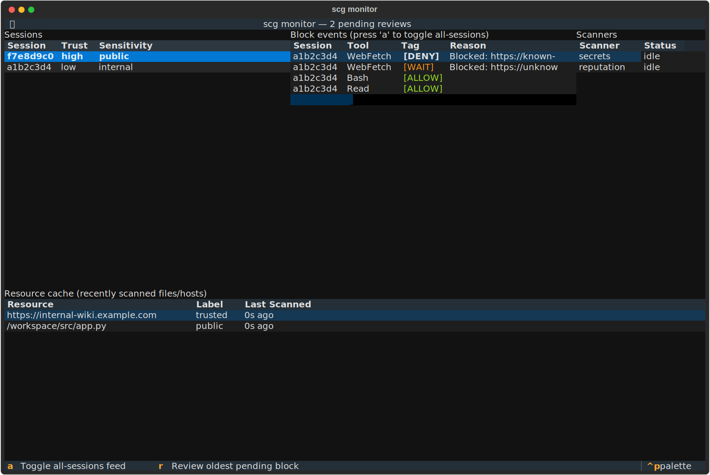
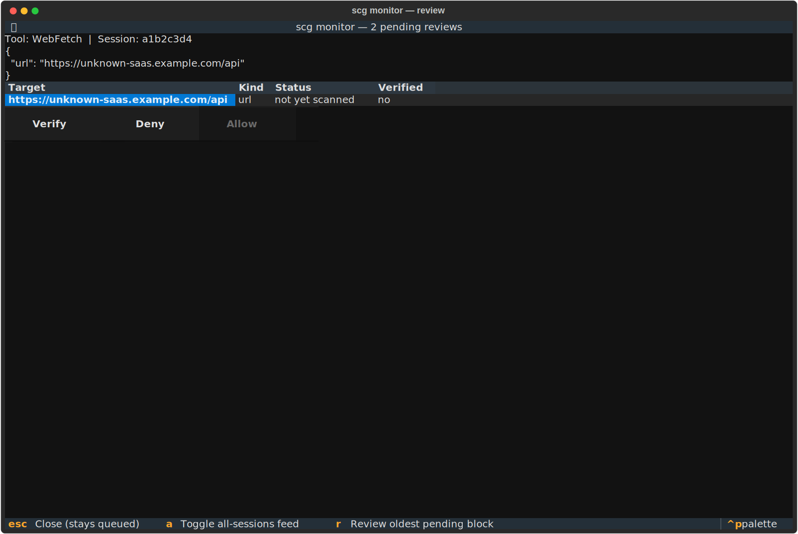
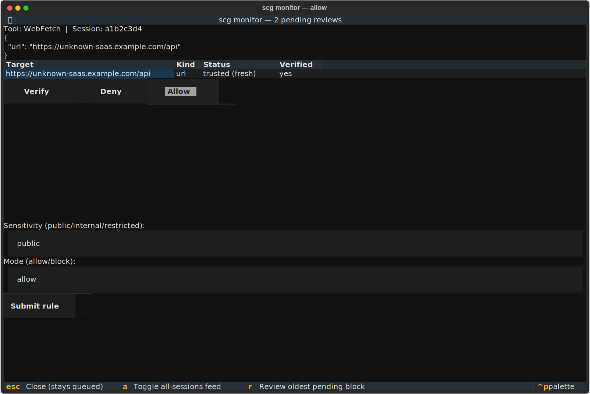

# `scg monitor` — Interactive TUI Guide

A full walkthrough of `scg monitor`, the live terminal dashboard over your
project's Scalene activity. New to Scalene entirely? Start with
[GETTING_STARTED.md](GETTING_STARTED.md) first. For the rest of the CLI,
see [USER_GUIDE.md](USER_GUIDE.md).

All screenshots on this page are real — generated by actually running
`MonitorApp` headless against seeded data
(`docs/generate_monitor_screenshots.py`), not mockups. Re-run that script
after any change to the TUI's appearance to keep this guide honest.

```
pip install scalene-guard[monitor]   # already included by `make setup` in this repo
scg monitor
```

Takes no flags. Run it in its own terminal, alongside the agent session you
want to watch.

---

## The main view



Four panels, all reading real files directly (`.scalene/audit.log`,
`.scalene/scan_cache.json`, `.scalene/state/*.json`) on a 0.5s poll — none
of them keep a separate summary that could drift from what the live hook
actually consults.

- **Sessions** (top-left) — one row per active agent session, with its
  current `trust`/`sensitivity` tags. Click a row (or it's selected by
  default) to filter the event log to that session; press **`a`** to
  toggle showing every session's events at once.
- **Block events** (top-middle) — every tool call the hook evaluates,
  allow or block, newest first. Each row carries a **text tag**, not just
  color, so it's legible over SSH or for a colorblind user:

  | Tag | Meaning |
  |-----|---------|
  | `[ALLOW]` | The call proceeded. |
  | `[WAIT]` | Blocked, nothing confirmed wrong yet — review it, then retry. |
  | `[DENY]` | Blocked, a real scanner finding or an explicit non-allow rule — don't retry without a rule/config change. |
  | `[BLOCK]` | A pre-upgrade audit-log entry with no tag data (backward-compat fallback). |

  Color is layered on top (green/yellow/red) as a secondary cue — the text
  alone already carries the full meaning.
- **Scanners** (top-right) — one row per configured scanner (built-ins,
  plus anything you've registered via `scalene_policy.yaml`'s `scanners:`
  section), showing real idle/busy state from the scan cache's own
  in-flight reservations.
- **Resource cache** (bottom) — every file/URL Scalene has scanned
  recently, its label, and how long ago it was scanned.

When a call gets blocked, the window title picks up a live count (e.g.
*"scg monitor — 2 pending reviews"*) and the terminal bell rings — you
don't have to be staring at the screen to notice.

---

## Reviewing a blocked call

Press **`r`** to open the dashboard for the oldest unreviewed block (first
in, first reviewed):



You see exactly what the hook saw: the tool name, the real call arguments
as JSON, and every identified target with its current onboarded/validated
status. A target that's never been scanned reads `not yet scanned`; once
scanned, it reads `<label> (fresh)` or `<label> (expired)` depending on
Scalene's own 24h freshness window.

Three actions, always visible:

- **Verify** — runs a real scan against every listed target. This doesn't
  decide anything by itself; it populates the scan cache so you (and the
  next `Allow`) have real, current data to act on. While a scan is in
  flight you'll see it reflected in the Scanners panel's busy state on the
  main view too — Verify reuses the exact same activity signal.
- **Deny** — closes the review. Nothing is written; the original call stays
  blocked, same as it already was.
- **Allow** — **stays disabled until every target has been Verified.**
  There's no way to click past this — it's Textual's real disabled state,
  not just a greyed-out hint.

Pressing **Escape** instead of choosing an action just closes the
dashboard for now — the review stays queued, ready to reopen with `r`
again. Nothing about the original call changes either way; it was already
resolved (denied) the moment it happened. This dashboard is a to-do list,
not a live gate.

---

## Allowing a target

Once every target is Verified, click **Allow** to reveal the rule form:



The `pattern` Scalene will write is derived from the real, exact resource
that was blocked — the same tight, narrow default `scg onboard` uses, not
a wildcard. You only choose:

- **Sensitivity** — `public` / `internal` / `restricted` (defaults `public`).
- **Mode** — `allow` / `block` (defaults `allow`). Use `block` to
  explicitly declare a *confirmed-bad* finding blocked-on-purpose, backed
  by a real scan result — the one case where `Allow`'s form is still the
  right place to author a deliberate block.

Click **Submit rule** to write it to your real `scalene_policy.yaml` —
the same file `scg onboard` writes to, no separate mechanism. The review
dequeues, and the identical original tool call — retried by the agent —
is now genuinely allowed.

If a target's last scan came back with a real finding (`sensitive` /
`untrusted`) and you leave Mode at `allow`, the submit is rejected with a
clear reason instead of silently writing a rule that contradicts the scan
— the same guard `scg onboard` has always applied, reused here rather than
duplicated.

---

## What the agent sees, meanwhile

None of this dashboard is visible to the agent whose call got blocked —
`scg monitor` is entirely operator-side. What the agent *does* see, in its
own tool-call response, is the `reason` text explaining the block, worded
to tell it what to do next:

- Blocked with nothing confirmed wrong yet → *"...has no validated,
  explicitly-allowed rule... **Wait for review, then retry.**"*
- Blocked on a real finding → *"...**Do not retry without a rule/config
  change.**"*

So the loop is: agent gets blocked and told to wait → you see it land in
`scg monitor`, tagged `[WAIT]` or `[DENY]` → you review, Verify, and Allow
(or Deny) → the agent retries and either succeeds or gets the same
guidance again.

---

## Regenerating the screenshots on this page

```
python docs/generate_monitor_screenshots.py
```

Boots the real `MonitorApp` headless (Textual's own test harness) against
seeded session/event/cache data and exports real SVG screenshots to
`docs/images/`. No mocking, no hand-editing the output — if the TUI's
appearance changes, re-run this and the diff shows exactly what changed.
